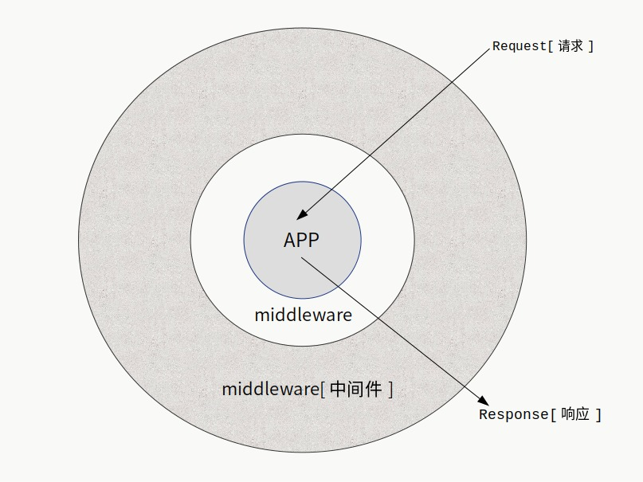
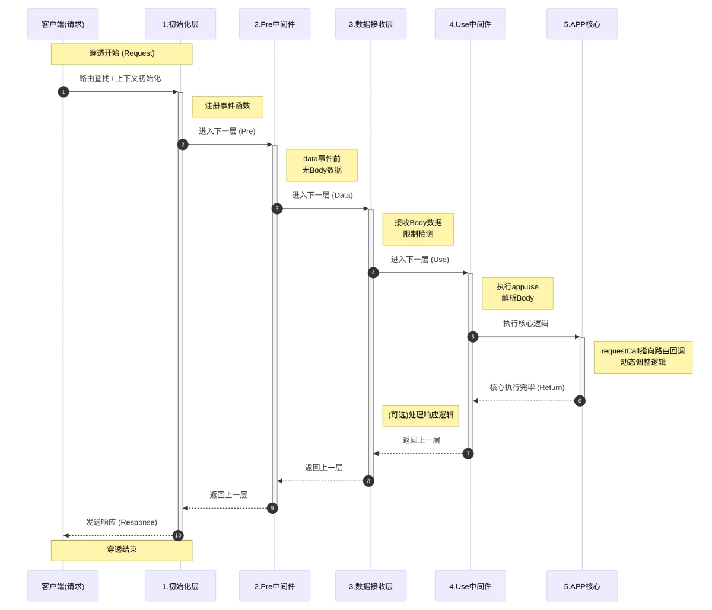

# Topbit

#### [English Documentation](README.en.md)

topbit是基于Node.js的运行于服务端的Web框架，它没有任何第三方依赖，在独特的路由和中间件分组执行机制上进行了极致优化。


**核心功能：**

* 请求上下文设计屏蔽接口差异。

* 全局中间件模式。

* 路由分组和路由命名。

* 中间件按照路由分组执行。中间件匹配请求方法和路由来执行。

* 开启守护进程，支持多进程集群以及worker进程自动化负载调整。

* 显示子进程负载情况。

* 默认解析body数据。

* 支持通过配置启用HTTP/1.1或是HTTP/2服务。允许同时支持HTTP/2和HTTP/1.1。

* 支持配置启用HTTPS服务（HTTP/2服务必须要开启HTTPS）。

* 限制请求数量。限制一段时间内单个IP的最大访问次数。

* IP黑名单和IP白名单。

* 在cluster模式，监控子进程超出最大内存限制则重启。

* 可选择是否开启自动负载模式：根据负载创建新的子进程处理请求，并在空闲时恢复初始状态。

* 默认设定和网络安全相关的配置，避免软件服务层面的DDOS攻击和其他网络安全问题。


## 📦安装

```javascript
npm i topbit
```

同样可以通过yarn安装：

```javascript
yarn add topbit
```


## 最小示例

```javascript
'use strict'

const Topbit = require('topbit')

const app = new Topbit({
  debug: true
})

//输出服务信息并运行服务
app.printServInfo().run(1234)

```

当不填加路由时，topbit默认添加一个路由：

`/*`

浏览器访问会看到一个非常简单的页面，这仅仅是为了方便最开始的了解和访问文档，它不会对实际开发有任何影响。


## 添加一个路由

``` JavaScript
'use strict'

const Topbit = require('topbit')

const app = new Topbit({
  debug: true
})


app.get('/', async ctx => {
  ctx.to('success')
})

//默认监听0.0.0.0，参数和原生接口listen一致。
app.run(1234)

```

ctx.data是返回的响应数据，也可以使用ctx.to(data)
> 其实 ctx.to()内部就是设置ctx.data的值。**推荐使用 ctx.to()设置返回的数据。**

## 使用import导入

在 `.mjs` 文件中，可以使用ES6的import进行导入：

```javascript
import Topbit from 'topbit'

const app = new Topbit({
  debug: true
})

app.get('/', async ctx => {
    ctx.to('success')
})

app.printServInfo().run(1234)

```

## 路由和请求类型

HTTP的起始行给出了请求类型，也被称为：请求方法。目前的请求方法：
```
GET POST PUT PATCH DELETE OPTIONS  TRACE HEAD
```

最常用的是前面6个。对于每个请求类型，router中都有同名但是小写的函数进行路由挂载。为了方便调用，在初始化app后，可以使用app上同名的快捷调用。（框架层面仅支持这些。）

**示例：**

``` JavaScript

'use strict'

const Topbit = require('topbit')

const app = new Topbit({
  debug: true
})

app.get('/', async c => {
  c.to('success')
})

app.get('/p', async c => {
  c.to(`${c.method} ${c.routepath}`)
})

app.post('/', async c => {
  //返回上传的数据
  c.to(c.body)
})

app.put('/p', async c => {
  c.to({
    method : c.method,
    body : c.body,
    query : c.query
  })
})

//默认监听0.0.0.0，参数和原生接口listen一致。
app.printServInfo().run(8080)

```


## 获取URL参数

- URL中的查询字符串（?后面a=1&b=2形式的参数）解析到c.query中。

- 表单提交的数据解析到c.body中。

> 表单对应的content-type为application/x-www-form-urlencoded


``` JavaScript
'use strict';

const Topbit = require('topbit')

let app = new Topbit({
    debug: true
})

app.get('/q', async c => {
  //URL中?后面的查询字符串解析到query中。
  //返回JSON文本，主要区别在于header中content-type为text/json
  c.to(c.query)
})

app.post('/p', async c => {
  //POST、PUT提交的数据保存到body，如果是表单则会自动解析，否则只是保存原始文本值，
  //可以使用中间件处理各种数据。
  c.to(c.body)
})

app.run(2019)

```

## 获取POST提交的数据

提交请求体数据的请求是POST、PUT。在前端页面中，一般是表单提交，或者是异步请求。

- 表单提交的数据解析到c.body中。

> 表单对应的content-type为application/x-www-form-urlencoded

> 异步请求的数据很多时候content-type是applicaiton/json

以上两种类型，对应的c.body都是一个object。

``` JavaScript
'use strict'

const Topbit = require('topbit')

let app = new Topbit({debug: true})

app.post('/p', async c => {
  //POST、PUT提交的数据保存到body，如果是表单则会自动解析为object，
  //可以使用中间件处理各种数据。
  c.to(c.body)
});

app.run(2019)

```

## 关于content-type

**application/x-www-form-urlencoded**

基本的表单类型会解析到c.body，是一个JS对象。

**text/\***

若content-type是text/*，就是text/开头的类型，比如text/json，框架层面不做解析处理，仅仅是把上传数据以utf8编码的格式转换成字符串赋值给c.body。后续的处理开发者自行决定。

**multipart/form-data;boundary=xxx**

若content-type是上传文件类型则默认会解析，解析后的文件对象放在c.files中，可以通过c.getFile获取。

**application/json**

这种类型会进行JSON.parse解析。

**其他类型**

若content-type是其他类型，则默认只是让c.body指向c.rawBody，即为最原始的Buffer数据。

框架层面提供基本的核心的支持，其他类型需要开发处理或者是使用扩展。

要比较容易使用，也要留出足够的空间给开发者处理，你可以完全抛弃框架默认的body解析，通过初始化选项parseBody设置为false关闭它。也可以在这基础上，进行扩展处理。

body解析模块本质上是一个中间件，这样设计的目的就是为了方便扩展和替换。

## to函数返回数据

to函数就是对c.data的包装，其实就是设置了c.data的值。另外还有两个别名的函数：ok、oo。根据场景可以自由选择。

``` JavaScript

app.get('/', async c => {
  c.to('success')
})

app.get('/randerr', async c => {
  let n = parseInt(Math.random() * 10)
  if (n >= 5) {
    c.ok('success')
  } else {
    //返回404状态码
    /*
      等效于：
        c.status(404).data = 'not found'
    */
   //你可以在v22.4.6以上的版本使用链式调用。
    c.status(404).oo('not found')
  }
})

app.run(1234)

```

## 链式调用

可以对setHeader、status、sendHeader使用链式调用。

```javascript

app.get('/', async c => {

  c.setHeader('content-type', 'text/plain; charset=utf-8')
    .setHeader('x-server', 'nodejs server')
    .status(200)
    .to(`${Date.now()} Math.random()}`)

})

```

## 路由参数

``` JavaScript
app.get('/:name/:id', async c => {
  //使用:表示路由参数，请求参数被解析到c.param
  let username = c.param.name;
  let uid = c.param.id;
  c.to(`${username} ${id}`)
})

app.run(8000)
```

## 任意路径参数

\* 表示任意路径，但是必须出现在路由最后。

``` JavaScript

app.get('/static/*', async c => {
  //*表示的任意路径解析到c.param.starPath
  let spath = c.param.starPath

  c.to(spath)
})

```

----

## 路由查找规则

----

路由查找过程，主要是对带参数路由和带 * 的路由进行了严格的顺序控制，而不是按照添加顺序进行匹配。

采用之前的版本开发的应用仍然不受影响，不存在兼容性问题。更严格的顺序减少了冲突的可能。

路由查找策略：

1. 普通字符串路径。
2. 带参数路由，参数少的路由会先匹配。
3. 带 * 的路由，按照最长到最短的模式匹配。

```
示例：
存在路由： /x/y/:id  /x/y/* /x/*  /x/:key/:id

/x/y/123 先匹配 /x/y/:id，不会继续匹配。

/x/y/123/345 先匹配到 /x/y/*，不会继续匹配。

/x/q/123 会匹配到 /x/:key/:id。

/x/a.jpg 会匹配到 /x/*，其他路由都无法匹配。

/x/static/images/a.jpg 会匹配到 /x/*，其他路由都无法匹配。

```

----

## 分组添加路由

你可以使用app.middleware指定中间件并使用返回的group方法添加分组路由，或者直接使用app.group分组添加路由。

**topbit.prototype.middleware(mids, options=null)**

- mids是一个数组，每个元素是一个中间件函数或一个数组，数组的第一个元素是中间件，第二个是添加中间件的选项。

- options默认为null，传递一个object为针对所有mids的选项，比如{pre: true}

**topbit.prototype.group(group_name, callback, prefix=true)**

- group_name 是一个字符串，表示路由分组的名称，如果是合法的路径，也作为路由的前缀。

- callback 回调函数，回调函数接收的参数仍然可以调用middleware和group，同时可以调用get、post等方法添加路由。

- prefix 布尔值，默认为true，用于控制group_name是否添加为路由的前缀，不过只有在group_name为合法的路由字符串才会作为前缀。


```javascript
'use strict'

const Topbit = require('topbit')

const app = new Topbit({
  debug: true
})

//中间件函数
let mid_timing = async (c, next) => {
  console.time('request')
  await next(c)
  console.timeEnd('request')
}

//group返回值可以使用use、pre添加中间件。
// /api同时会添加到路由的前缀。
app.group('/api', route => {
  route.get('/test', async c => {
    c.to('api test')
  })

  route.get('/:name', async c => {
    c.to(c.param)
  })
})

//添加中间件到对应分组
app.use(
  async (c, next) => {
    console.log(c.method, c.headers)
    await next(c)
  }, {group: '/sub'}
).group('/sub', route => {
  route.get('/:id', async c => {
    c.to(c.param.id)
  })
})

//测试 不符合 路由规则，所以不会作为路径的前缀。
app.group('测试', route => {
  route.get('/test', async c => {
    console.log(c.group, c.name)
    c.to('test ok')
  }, 'test')
})

app.run(1234)

```

以上这种方式在指定多个中间件的时候会有些复杂，可以使用middleware方法。参考以下示例。

### 给分组和子分组指派中间件

```javascript
'use strict'

const Topbit = require('topbit')
//导入ToFile扩展
const {ToFile} = Topbit.extensions

const app = new Topbit({
  debug: true
})

//中间件函数
let mid_timing = async (c, next) => {
  console.time('request')
  await next(c)
  console.timeEnd('request')
}

let sub_mid_test = async (c, next) => {
  console.log('mid test start')
  await next(c)
  console.log('mid test end')
}

//group返回值可以使用use、pre、middleware添加中间件。
// /api同时会添加到路由的前缀。

app.middleware([
     //耗时记录中间件，在接收请求提数据之前进行，所以pre设置为true
     [ mid_timing, {pre: true} ],

     //ToFile扩展在接收请求体数据之后运行，并且只针对POST和PUT请求执行
     [ new ToFile(), {method: ['POST', 'PUT']} ]
  ])
  .group('/api', route => {
      route.get('/test', async c => {
        c.to('api test')
      })

      route.get('/:name', async c => {
        c.to(c.param)
      })

      //子分组 /sub启用中间件sub_mid_test，同时，子分组会启用上一层的所有中间件。
      route.middleware([sub_mid_test])
        .group('/sub', sub => {
            sub.get('/:key', async c => {
              c.to(c.param)
            })
        })
  })

app.run(1234)

```

分组支持嵌套调用，但是层级不能超过9。通常超过3层的嵌套分组就是有问题的，需要重新设计。

**这个功能，不如TopbitLoader扩展的自动加载机制方便易用，但是在实际情况中。有各种各样的需求。并且有时候不得不利用单文件做服务，同时还要能够兼顾框架本身的路由和中间件分组的优势，还要能够方便的编写逻辑明确，结构清晰的代码，因此middleware、group的接口功能可以方便处理，并且若不习惯TopbitLoader的MCM模式(Middleware - Controller - Model，类似MVC的模式)，使用这个方式也可以很好的组合其他模块代码。**

以上路由指派分组的功能是非侵入式的，它不会影响已有代码，也不会和TopbitLoader冲突。

**!! 复杂的路由处理函数应该放在单独的模块中，使用一个统一的自动化加载函数来完成。**

支持使用返回值进行添加，也可以不必传递回调函数：

```javascript
'use strict'

const Topbit = require('topbit')
//导入ToFile扩展
const {ToFile} = Topbit.extensions

const app = new Topbit({
  debug: true
})

//中间件函数
let mid_timing = async (c, next) => {
  console.time('request')
  await next(c)
  console.timeEnd('request')
}

let sub_mid_test = async (c, next) => {
  console.log('mid test start')
  await next(c)
  console.log('mid test end')
}

let route = app.middleware([
                //耗时记录中间件，在接收请求提数据之前进行，所以pre设置为true
                [ mid_timing, {pre: true} ],

                //ToFile扩展在接收请求体数据之后运行，并且只针对POST和PUT请求执行
                [ new ToFile(), {method: ['POST', 'PUT']} ]
              ])
              .group('/api')

route.get('/test', async c => {
  c.to('api test')
})

route.get('/:name', async c => {
  c.to(c.param)
})

//子分组 /sub启用中间件sub_mid_test，同时，子分组会启用上一层的所有中间件。
route.middleware([sub_mid_test])
  .group('/sub', sub => {
      sub.get('/:key', async c => {
        c.to(c.param)
      })
  })

app.run(1234)

```

----

## 上传文件

默认会解析上传的文件，你可以在初始化服务的时候，传递parseBody选项关闭它，关于选项后面有详细的说明。
解析后的文件数据在c.files中存储，具体结构在后面有展示。

``` JavaScript
'use strict'

const Topbit = require('topbit')

const app = new Topbit()

app.post('/upload', async c => {
  
  let f = c.getFile('image')

  //根据原始文件名解析扩展名并生成时间戳加随机数的唯一文件名。

  let fname = c.ext.makeName(f.filename)

  try {
    c.to(await c.moveFile(f, fname))
  } catch (err) {
    c.status(500).to(err.message)
  }
  
}, 'upload-image'); //给路由命名为upload-image，可以在c.name中获取。

app.run(1234)

```

## c.files数据结构

这种结构是根据HTTP协议上传文件时的数据构造设计的，HTTP协议允许同一个上传名有多个文件，所以要解析成一个数组。而使用getFile默认情况只返回第一个文件，因为多数情况只是一个上传名对应一个文件。

> 对于前端来说，上传名就是你在HTML中表单的name属性：&lt;input type="file" name="image"&gt;
> image是上传名，不要把上传名和文件名混淆。


```

{
  image : [
    {
      type: CONTENT_TYPE,
      filename: ORIGIN_FILENAME,
      start : START,
      end   : END,
      length: LENGTH,
      rawHeader: HEADER_DATA,
      headers: {...}
    },
    ...
  ],

  video : [
    {
      type: CONTENT_TYPE,
      filename: ORIGIN_FILENAME,
      start : START,
      end   : END,
      length: LENGTH,
      rawHeader: HEADER_DATA,
      headers: {...}
    },
    ...
  ]
}
```

c.getFile就是通过名称索引，默认索引值是0，如果是一个小于0的数字，则会获取整个文件数组，没有返回null。


## body最大数据量限制

```javascript
'use strict'

const Topbit = require('topbit')

const app = new Topbit({
  //允许POST或PUT请求提交的数据量最大值为将近20M。
  //单位为字节。
  maxBody: 20000000
})

//...

app.run(1234)

```


## 中间件

中间件是一个很有用的模式，不同语言实现起来多少还是有些区别的，但是本质上没有区别。中间件的运行机制允许开发者更好的组织代码，方便实现复杂的逻辑需求。事实上，整个框架的运行机制都是中间件模式。

中间件图示：



此框架的中间件在设计层面上，按照路由分组区分，也可以识别不同请求类型，确定是否执行还是跳过到下一层，所以速度非常快，而且多个路由和分组都具备自己的中间件，相互不冲突，也不会有无意义的调用。参考形式如下：

``` JavaScript

/*
  第二个参数可以不填写，表示全局开启中间件。
  现在第二个参数表示：只对POST请求方法才会执行，并且路由分组必须是/api。
  基于这样的设计，可以保证按需执行，不做太多无意义的操作。
*/
app.add(async (c, next) => {
    console.log('before');
    await next(c);
    console.log('after');
}, {method: 'POST', group: '/api'});

```

使用add添加的中间件是按照添加顺序逆序执行，这是标准的洋葱模型。为了提供容易理解的逻辑，提供use接口添加中间件，使用use添加的中间件按照添加顺序执行。不同的框架对实现顺序的逻辑往往会不同，但是顺序执行更符合开发者习惯。

**建议只使用use来添加中间件：**

``` JavaScript
//先执行
app.use(async (c, next) => {
  let start_time = Date.now()
  await next(c)
  let end_time = Date.now()
  console.log(end_time - start_time)
})

//后执行
app.use(async (c, next) => {
  console.log(c.method, c.path)
  await next(c)
})

//use可以级联: app.use(m1).use(m2)

```

## topbit完整的流程图示




> **需要知道的是，其实在内部，body数据接收和解析也都是中间件，只是刻意安排了顺序，分出了pre和use接口。**


## 中间件参数

使用use或者pre接口添加中间件，还支持第二个参数，可以进行精确的控制，传递选项属性：

* group  路由分组，表示针对哪个分组执行。

* method 请求方法，可以是字符串或数组，必须大写。

* name  请求名称，表示只针对此请求执行。

示例：

```javascript

app.get('/xyz', async c => {
  //...
  //路由分组命名为proxy
}, {group: 'proxy'})

app.use(proxy, {
  method : ['PUT', 'POST', 'GET', 'DELETE', 'OPTIONS'],
  //针对路由分组proxy的请求执行。
  group : 'proxy'
})
```


## pre 在接收body数据之前

使用pre接口添加的中间件和use添加的主要区别就是会在接收body数据之前执行。可用于在接收数据之前的权限过滤操作。其参数和use一致。

为了一致的开发体验，你可以直接使用use接口，只需要在选项中通过pre指定：

```javascript
let setbodysize = async (c, next) => {
    //设定body最大接收数据为~10k。
    c.maxBody = 10000;
    await next(c);
};

//等效于app.pre(setbodysize);
app.use(setbodysize, {pre: true});

```

使用pre可以进行更复杂的处理，并且可以拦截并不执行下一层，比如topbit-toolkit扩展的proxy模块利用这个特性直接实现了高性能的代理服务，但是仅仅作为框架的一个中间件。其主要操作就是在这一层，直接设置了request的data事件来接收数据，并作其他处理，之后直接返回。

**根据不同的请求类型动态限制请求体大小**

这个需求可以通过pre添加中间件解决：

```javascript

const app = new Topbit({
  //默认最大请求体 ~10M 限制。
  maxBody: 10000000
})

app.pre(async (c, next) => {

  let ctype = c.headers['content-type'] || ''

  if (ctype.indexOf('text/') === 0) {
    //50K
    c.maxBody = 50000
  } else if (ctype.indexOf('application/') === 0) {
    //100K
    c.maxBody = 100000
  } else if (ctype.indexOf('multipart/form-data') < 0) {
    //10K
    c.maxBody = 10000
  }

  await next(c)

}, {method: ['POST', 'PUT']})


```

这些参数若同时出现在文件里会显得很复杂，维护也不方便，但是功能很强，所以若要交给程序自动完成则可以大大简化编码的工作。

**完整的项目结构搭建，请配合使用topbit-loader，此扩展完成了路由、模型的自动加载和中间件自动编排。<a target=_blank href="https://gitee.com/daoio/topbit-loader">topbit-loader</a>**


## HTTPS

```javascript
'use strict'

const Topbit = require('topbit')

//只需要传递证书和密钥文件所在路径
const app = new Topbit({
    // './xxx.pem'文件也可以
    cert: './xxx.cert',
    key: './xxx.key'
})

app.run(1234)

```

## 同时支持HTTP/2和HTTP/1.1(兼容模式)

兼容模式是利用ALPN协议，需要使用HTTPS才可以，所以必须要配置证书和密钥。

```javascript
'use strict'

const Topbit = require('topbit')

//只需要传递证书和密钥文件所在路径
const app = new Topbit({
    cert: './xxx.cert',
    key: './xxx.key',
    //启用http2并允许http1，会自动启用兼容模式
    http2: true,
    allowHTTP1: true
})

app.run(1234)

```


## 配置选项

应用初始化，完整的配置选项如下，请仔细阅读注释说明。

``` JavaScript
  {
    //此配置表示POST/PUT提交表单的最大字节数，也是上传文件的最大限制。
    maxBody   : 8000000,

    //最大解析的文件数量
    maxFiles      : 12,

    /*
      开启守护进程模式后，如果设置路径不为空字符串，则会把pid写入到此文件，可用于服务管理。
    */
    pidFile       : '',

    //是否开启全局日志，true表示开启，这时候会把请求信息输出或者写入到文件
    globalLog: false,

    //日志输出方式：stdio表示输出到终端，file表示输出到文件
    logType : 'stdio',

    //正确请求日志输出的文件路径
    logFile : '',

    //错误请求日志输出的文件路径
    errorLogFile : '',

    //日志文件最大条数
    logMaxLines: 50000,

    //最大历史日志文件数量
    logHistory: 50,

    //自定义日志处理函数
    logHandle: null,

    //开启HTTPS
    https       : false,

    http2   : false,

    allowHTTP1: false,

    //HTTPS密钥和证书的文件路径，如果设置了路径，则会自动设置https为true。
    key   : '',
    cert  : '',

    //服务器选项都写在server中，在初始化http服务时会传递，参考http2.createSecureServer、tls.createServer
    server : {
      handshakeTimeout: 8192, //TLS握手连接（HANDSHAKE）超时
      //sessionTimeout: 350,
    },

    //设置服务器超时，毫秒单位，在具体的请求中，可以再设置请求的超时。
    timeout   : 15000,

    debug     : false,

    //忽略路径末尾的 /
    ignoreSlash: true,

    //启用请求限制
    useLimit: false,

    //最大连接数，0表示不限制
    maxConn : 1024,

    //单个IP单位时间内的最大连接数，0表示不限制
    maxIPRequest: 0,

    //针对IP的限流单位时间，1表示1秒，默认为60秒，0.1 ~ 86400
    unitTime : 60,
    
    //展示负载信息，需要通过daemon接口开启cluster集群模式
    loadMonitor : true,

    //负载信息的类型，text 、null, obj, orgobj
    //json类型是给程序通信使用的，方便接口开发
    loadInfoType : 'text',

    //负载信息的文件路径，如果不设置则输出到终端，否则保存到文件
    loadInfoFile : '',

    //404要返回的数据
    notFound: 'Not Found',
    
    //400要返回的数据
    badRequest : 'Bad Request',

    //控制子进程最大内存使用量的百分比参数，范围从-0.42 ～ 0.36。基础数值是0.52，所以默认值百分比为80%。
    memFactor: 0.28,

    //url最大长度
    maxUrlLength: 2048,

    //子进程汇报资源信息的定时器毫秒数。
    monitorTimeSlice: 640,

    //在globalLog为true时，全局日志是否记录真实的IP地址，主要用在反向代理模式下。
    realIP: false,

    //允许的最大querystring参数个数。
    maxQuery: 25,

    //是否启用strong模式，启用后会使用process处理rejectionHandled 和 uncaughtException事件，
    //并捕获一些错误：TypeError,ReferenceError,RangeError,AssertionError,URIError,Error。
    strong: false,

    //快速解析querystring，多个同名的值会仅设置第一个，不会解析成数组。
    fastParseQuery: false,
    
    //是否自动解码Query参数，会调用decodeURIComponent函数。
    autoDecodeQuery: true,

    //在multipart格式中，限制单个表单项的最大长度。
    maxFormLength: 1000000,

    /* 错误处理函数，此函数统一收集服务运行时出现的
          tlsClientError、服务器error、secureConnection错误、clientError、运行时的抛出错误。
      errname是一个标记错误信息和出现位置的字符串，统一格式为--ERR-CONNECTION--、--ERR-CLIENT--这种形式。

      通常Node.js抛出错误会有code和message等信息方便识别和排查，也不排除有抛出错误没有code的情况，
        errname可用可不用，但是参数会进行传递。
      通过配置选项传递自定函数即可实现自定义错误收集和处理方式。
    */
    errorHandle: (err, errname) => {
      this.config.debug && console.error(errname, err)
    },

    //最大负载率百分比，默认为0.75表示当CPU使用率超过75%，则会自动创建子进程。
    //必须通过autoWorker开启自动负载模式才有效。
    maxLoadRate: 0.75,

    //http2协议的http2Stream超时，若不设置，-1表示和timeout一致。
    streamTimeout: -1,

    //请求超时时间，此超时时间是请求总的时间，主要是为了应对恶意请求。
    //比如，发出大量请求，每个请求每秒发送一个字节，空闲超时不会起作用，则可以长期占有服务器资源。
    //在大量请求时，正常用户无法访问，此攻击属于DDOS。
    requestTimeout: 100000,

  };
  // 对于HTTP状态码，在这里仅需要这两个，其他很多是可以不必完整支持，并且你可以在实现应用时自行处理。
  // 因为一旦能够开始执行，就可以通过运行状态返回对应的状态码。
  // 而在这之前，框架还在为开始执行洋葱模型做准备，不过此过程非常快。

```

## 请求上下文

请求上下文就是一个封装了各种请求数据的对象。通过这样的设计，把HTTP/1.1 和 HTTP/2协议的一些差异以及Node.js版本演进带来的一些不兼容做了处理，出于设计和性能上的考虑，对于HTTP2模块，封装请求对象是stream，而不是http模块的IncomingMessage和ServerResponse（封装对象是request和response）。

**请求上下文属性和基本描述**

| 属性 | 描述 |
| ---- | ---- |
| version | 协议版本，字符串类型，为'1.1' 或 '2'。 |
| major | 协议主要版本号，1、2、3分别表示HTTP/1.1 HTTP/2 HTTP/3（目前还没有3）。 |
| maxBody | 支持的最大请求体字节数，数字类型，默认为初始化时，传递的选项maxBody的值，可以在中间件中根据请求自动设定。 |
| method | 请求类型，GET POST等HTTP请求类型，大写字母的字符串。 |
| host | 服务的主机名，就是request.headers.host的值。 |
| protocol | 协议字符串，不带冒号，'https'、'http'。 |
| path | 具体请求的路径。 |
| routepath | 实际执行请求的路由字符串。 |
| query | url传递的参数。 |
| param | 路由参数。 |
| files | 上传文件保存的信息。 |
| body | body请求体的数据，具体格式需要看content-type，一般为字符串或者对象，也可能是buffer。 |
| port | 客户端请求的端口号。 |
| ip | 客户端请求的IP地址，是套接字的地址，如果使用了代理服务器，需要检测x-real-ip或是x-forwarded-for消息头获取真正的IP。 |
| headers | 指向request.headers。 |
| isUpload() | 是否为上传文件请求，此时就是检测消息头content-type是否为multipart/form-data格式。 |
| name | 路由名称，默认为空字符串。 |
| group | 路由分组，默认为空字符串。 |
| res | HTTP/1.1协议，指向response，HTTP/2 指向stream。 |
| req | HTTP/1.1 就是http模块request事件的参数IncomingMessage对象，HTTP/2 指向stream对象。 |
| box | 默认为空对象，可以添加任何属性值，用来动态传递给下一层组件需要使用的信息。 |
| service | 用于依赖注入的对象，指向app.service。 |
| data | 保存最后要返回到客户端的数据，给data赋值即可，或者直接使用ctx.to函数。在v24.x版本以前，是ctx\.res\.body。 |
| ext | 提供了一些助手函数，具体参考wiki。 |
| to(data) | 函数，用来设置ctx.data的数据。 |
| write(data) | 直接写入数据到客户端。 |
| moveFile(file:object, target_filepath:string) | 函数，用来移动上传的文件到指定路径。 |
| status() | 函数，设置状态码。 |
| setHeader(k, v) | 函数，设置消息头。 |
| removeHeader(k) | 函数，移除等待发送的消息头。 |
| getFile(name) | 函数，获取上传的文件信息，其实就是读取files属性的信息。 |
| sendHeader() | 函数，用于http2发送消息头，setHeader只是缓存了设置的消息头。对于http/1.1来说，为了保持代码一致，只是一个空函数。 |
| user | 给用户登录提供一个标准属性，默认之为null。 |
| json(data) | 函数，设置返回数据，并标记类型为json。 |
| text(data) | 函数，设置返回数据，并标记类型为text。 |
| html(data) | 函数，设置返回数据，并标记类型为html。 |
| pipe(filepath) | 函数，流式响应数据，示例：await ctx.setHeader('content-type', 'text/html').pipe('./index.html') |
| pipeJson(filepath) | 以json类型流式响应文件数据。 |
| pipeText(filepath) | 以text类型流式响应文件数据。 |
| pipeHtml(filepath) | 以html类型流式响应文件数据。 |

注意：to函数只是设置ctx.data属性的值，在最后才会返回数据。和直接进行ctx.data赋值没有区别，只是因为函数调用如果出错会更快发现问题，而设置属性值写错了就是添加了一个新的属性，不会报错但是请求不会返回正确的数据。

## 依赖注入

请求上下文中有一项是service，指向的是app.service。当初始化app后，一切需要开始就初始化好的数据、实例等都可以挂载到app.service。

``` JavaScript

'use strict';

const Topbit = require('topbit')

let app = new Topbit({
  debug: true
});

//有则会覆盖，没有则添加。
app.addService('name', 'first')
app.addService('data', {
  id : 123,
  ip : '127.0.0.1'
})

/*
这可能看不出什么作用，毕竟在一个文件中，直接访问变量都可以，如果要做模块分离，就变得非常重要了。
*/
app.get('/info', async c => {
  c.to({
    name : c.service.name,
    data : c.service.data
  })
})

app.run(1234)

```

## 扩展请求上下文

如果需要给请求上下文的对象添加扩展支持，可以通过app实例的httpServ.context实现。此属性是请求上下文的构造函数。

**示例：**

```javascript
'use strict'

const Topbit = require('topbit')

const app = new Topbit({
    debug: true
})

//this即表示请求上下文
app.httpServ.context.prototype.testCtx = function () {
    console.log(this.method, this.path)
}

app.get('/test', async ctx => {
    ctx.testCtx()
})

app.run(1234)

```


## app.isMaster和app.isWorker

Node.js在v16.x版本开始，cluster模块推荐使用isPrimary代替isMaster，不过isMaster仍然是可用的，在topbit初始化app实例之后，app上有两个getter属性：isMaster和isWorker。作用和cluster上的属性一致，其目的在于：

- 在代码中不必再次编写const cluster = require('cluster')。

- 屏蔽未来cluster可能的不兼容更改，增强代码兼容性。


## daemon和run

run接口的参数为：port、host。host默认为0.0.0.0。还可以是sockPath，就是.sock文件路径，本质上是因为http的listen接口支持。使用.sock，host就被忽略了。

daemon的前两个参数和run一致，支持第三个参数是一个数字，表示要使用多少个子进程处理请求。默认为0，这时候会自动根据CPU核心数量创建子进程。之后，会保持子进程数量的稳定，在子进程意外终止后会创建新的子进程补充。

**cluster模式，最多子进程数量不会超过CPU核心数量的2倍。**

示例：

```

//host默认为0.0.0.0，端口1234
app.run(1234)

//监听localhost，只能本机访问
app.run(1234, 'localhost')

//使用两个子进程处理请求，host默认为0.0.0.0
app.daemon(1234, 2)

//使用3个子进程处理请求
app.daemon(1234, 'localhost', 3)

```

## 日志

框架本身提供了全局日志功能，当使用cluster模式时（使用daemon接口运行服务），使用初始化选项globoalLog可以开启全局日志，并且可以指定日志文件，在单进程模式，会把日志输出到终端，此时利用输出重定向和错误输出重定向仍然可以把日志保存到文件。

**注意：只有使用daemon运行，采用cluster模式，才可以把日志保存到文件，run运行后的单进程仅仅是输出到屏幕，可以利用IO重定向保存到文件。**

除了保存到文件和输出到终端进行调试，还可以利用logHandle选项设置自己的日志处理函数。

**设置了logHandle，logFile和errorLogFile会失效，具体请看代码。**

示例：

``` JavaScript

const Topbit = require('topbit')

const app = new Topbit({
  debug: true,
  //全局日志开启
  globalLog: true,

  //表示输出到文件，默认为stdio表示输出到终端。
  logType: 'file'

  //返回状态码为2xx或者3xx
  logFile : '/tmp/topbit.log',

  //错误的日志输出文件，返回状态码4xx或者5xx
  errorLogFile: '/tmp/topbit-error.log',

  //自定义处理函数，此时logFile和errorLogFile会失效。
  //接收参数为(worker, message)
  //worker具体参考cluster的worker文档
  /*
    msg为日志对象，属性：
      {
        type : '_log',
        success : true,
        log : '@ GET | https://localhost:2021/randst | 200 | 2020-10-31 20:27:7 | 127.0.0.1 | User-Agent'
      }
  */
  logHandle : (w, msg) => {
    console.log(w.id, msg)
  }

})

app.daemon(1234, 3)

```

使用中间件的方式处理日志和全局日志并不冲突，而如果要通过中间件进行日志处理会无法捕获没有路由返回404的情况，因为框架会先查找路由，没有则会返回。这时候，不会有请求上下文的创建，直接返回请求，避免无意义的操作。

而且，这样的方式其实更加容易和cluster模式结合，因为在内部就是利用master和worker的通信机制实现的。

## 消息事件处理

基于message事件，在daemon模式（基于cluster模块），提供了一个setMsgEvent函数用于获取子进程发送的事件消息并进行处理。

这要求worker进程发送的消息必须是一个对象，其中的type属性是必需的，表示消息事件的名称。其他字段的数据皆可以自定义。

使用方式如下：

``` JavaScript

const Topbit = require('topbit')
const cluster = require('cluster')

const app = new Topbit({
  debug: true,
  loadInfoFile: '/tmp/loadinfo.log'
})

if (cluster.isMaster) {
  app.setMsgEvent('test-msg', (worker, msg, handle) => {
    //子进程中会通过message事件收到消息
    worker.send({
      id : worker.id,
      data : 'ok'
    })

    console.log(msg)
  })
} else {
  //接收worker.to发送的消息
  process.on('message', msg => {
    console.log(msg)
  })

  setIneterval(() => {
    process.send({
      type : 'test-msg',
      pid : process.pid,
      time : (new Date()).toLocaleString()
    })
  }, 1000)

}

```

比较麻烦的地方在于，worker进程发送消息比较复杂，在22.4.0版本开始，提供了一个send方法用于快速发送消息。只有在worker进程中才会发送给master进程，所以不必额外进行worker进程检测。

## app.send 和 app.workerMsg

现在让我们来改写上面代码的worker进程发送消息的部分：

```javascript

const Topbit = require('topbit')

const app = new Topbit({
  debug: true,
  loadInfoFile: '/tmp/loadinfo.log'
})

//master进程注册消息事件类型，worker进程不会执行。
app.setMsgEvent('test-msg', (worker, msg, handle) => {
  //子进程中会通过message事件收到消息
  worker.send({
    id : worker.id,
    data : 'ok'
  })

  console.log(msg)
})

//只有worker进程才会监听。
app.workerMsg(msg => {
  console.log(msg)
})

cluster.isWorker
    &&
setInterval(() => {
  //只有worker会执行。
  app.send('test-msg', {
    pid: process.pid,
    time: (new Date).toLocaleString()
  })

}, 1000)

app.daemon(1234, 2)

```

## 自动调整子进程数量

通过daemon传递的参数作为基本的子进程数量，比如：

``` JavaScript

//使用2个子进程处理请求。
app.daemon(1234, 2)

```

如果需要自动根据负载创建子进程，并在负载空闲时终止进程，维持基本的数量，可以使用autoWorker接口来设置一个最大值，表示最大允许多少个子进程处理请求，这个值必须要比基本的子进程数量大才会生效。

```

//最大使用9个子进程处理请求。
app.autoWorker(9)

//...

app.daemon(1234, 2)

```

当负载过高时，会自动创建子进程，并且在空闲一段时间后，会自动终止连接数量为0的子进程，恢复到基本的数值。

**此功能在v21.9.6+版本可用。但是请尽可能使用最新版本，此功能在后续版本经历几次升级改进，提高了稳定性和性能，保证在严苛的业务逻辑上仍然能够提供稳定的服务支持。**

----

## 🛡️strong模式

通过strong选项可以开启strong模式，此模式会监听uncaughtException和unhandledRejection事件，保证程序稳定运行。最简单的情况，你只需要给strong设置为true即可。

**strong模式的所有功能都可以通过process模块自行实现，此处只是简化了处理方式而已。**

```javascript
'use strict';

const Topbit = require('topbit');

setTimeout(() => {
  //在定时器的循环里抛出异常
  throw new Error(`test error`)
}, 2000);

const app = new Topbit({
    //调试模式，输出错误信息。
    debug: true,
    //开启strong模式
    strong: true
});

app.run(1234);

```

默认情况下，strong模式会捕获以下错误：

```
'TypeError', 'ReferenceError', 'RangeError', 'AssertionError', 'URIError', 'Error'
```

但是，你可能需要自定义处理方式，这可以通过给strong传递object类型的选项来实现。

```javascript

//核心代码示例
const app = new Topbit({
    //调试模式，输出错误信息。
    debug: true,
    //开启strong模式
    strong: {
      //静默行为，不会输出错误。
      quiet: true,
      //自定义错误处理函数
      errorHandle: (err, errname) => {
        //....
      },

      //要捕获的错误有哪些
      catchErrors: [
        'TypeError', 'URIError', 'Error', 'RangeError'
      ]

    }
});

```

## 🔔同时运行http和https？

请注意这是打问号的，你最好不要在正式环境这样做，如果你已经开启了https，则不需要http，而且前端应用有些功能在不启用https是无法使用的。

如果你需要这样功能，也许是用于测试，那么你可以这样做：

```javascript
'use strict'

const Topbit = require('topbit')
const http = require('node:http')
const https = require('https')

const app = new Topbit({
    //启用调试
    debug: true,
})

//以下都是http/1.1的服务，若要同时支持http2，需要启用http2服务并兼容http1，若有需要请使用topbit-httpc扩展。

//这种情况下，你需要自己设定相关事件的监听处理。

let http_server = http.createServer(app.httpServ.onRequest())
let https_server = https.createServer(app.httpServ.onRequest())

http_server.listen(2025)
https_server.listen(2026)

```

**需要注意的是，这种情况无法再去支持http2，但是你可以使用http2去兼容http1。**

## 请求限流

框架层面提供的限流是基于IP地址的计算和过滤，避免同一个IP地址密集的发送请求。若使用HTTP/2协议，则需要配合使用扩展http2limit模块。

```javascript
'use strict';

const Topbit = require('topbit')

const app = new Topbit({
    debug : true,
    //启用请求限制
    useLimit: true,

    //允许访问，不做单位时间请求频率限制的IP地址
    allow: new Set(['127.0.0.1']),

    //拒绝连接的IP地址
    deny: (ip) => {
      //只是示例，支持函数和Set类型
      if (ip.indexOf('1.') === 0) return false
      return true
    },
    
    //每个IP地址单位时间内允许请求的次数
    maxIPRequest: 6,
    
    //单位时间，表示15秒
    unitTime: 15,
    
    //一个worker进程允许的最大并发连接
    maxConn: 2000,

    loadMonitor: true,
    loadInfoType : 'text',
    globalLog : true,
    logType: 'stdio',
    //负载信息放在内存中
    loadInfoFile : '--mem'
})


app.get('/', async ctx => {
  ctx.to('ok')
})

//使用3个worker进程处理请求，每个都支持单位时间内请求6次
//若想要大概总共处理6次，则设置maxIPRequest为2
app.daemon(1234, '0.0.0.0', 3)

```

## 其他

- topbit在运行后，会有一个最后包装的中间件做最终的处理，所以设置c.data的值就会返回数据，默认会检测一些简单的文本类型并自动设定content-type（text/plain,text/html,application/json）。注意这是在你没有设置content-type的情况下进行。

- 默认会限制url的最大长度，也会根据硬件情况设定一个最大内存使用率。

- 这一切你都可以通过配置选项或是中间件来进行扩展和重写，既有限制也有自由。

- 它很快，并且我们一直在都在关注优化。

- 提供了一个sched函数用来快速设置cluster模式的调度方式，支持参数为'rr'或'none'，本质就是设置cluster.schedulingPolicy的值。


框架在初始化会自动检测内存大小并设定相关上限，你可以在初始化后，通过更改secure中的属性来更改限制，这需要你使用daemon接口，也就是使用master管理子进程的模式。


```javascript
'use strict'

const Topbit = require('topbit')

let app = new Topbit()

/*
 以下操作可以通过选项memFactor控制，请参考上文的配置选项部分。
 */

//最大内存设定为600M，但是只有在连接数为0时才会自动重启。
app.secure.maxmem = 600_000_000;

//必须要重启的最大内存上限设定为900M，注意这是总的内存使用，包括你用Buffer申请的内存。
//这个值一般要比maxmem大，当内存使用超过maxmem设置的值，
//但是连接不为0，这时候如果继续请求超过diemem设置的值，则会直接重启进程。
app.secure.diemem = 900_000_000;

//最大内存使用设置为800M，这个就是程序运行使用的内存，但是不包括Buffer申请的内存。
app.secure.maxrss = 800_000_000;

app.get('/', async c => {
  c.to('ok')
})

app.daemon(8008, 2)

```

**注意，这需要你开启loadMonitor选项，这是默认开启的。**

---

# 🧩 中间件扩展和其他扩展 📜

---

作为Web框架，仅仅提供基础功能是不够的，很多基础功能在所有Web服务上都会用到，所以必然会出现通用的扩展模块。

在Topbit全局中间件设计机制上，大部分和Web服务有关的扩展都可以通过开发一个中间件扩展完成，可以参考 `中间件` 部分，这种插件机制十分灵活。

**Topbit提供了一些通用中间件扩展，开发者可以按需使用。**

**也提供了一些其他扩展模块：路由加载器、Token会话验证、命令参数解析、错误日志自动化处理、zip压缩和解压。**

## 导入中间件扩展

所有中间件扩展都在Topbit.extensions下，示例：

```javascript
'use strict'

process.chdir(__dirname)

const Topbit = require('Topbit')

//通过解构赋值导入扩展
const {Cors, ToFile} = Topbit.extensions

const app = new Topbit({
  debug: true,
  //开启日志，是globalLog的别名
  log: true
})

// 跨域扩展在解析body之前运行
// use添加的中间件解析body数据之后运行
app.pre(new Cors())
  .use(new ToFile, {method: ['PUT', 'POST']})

app.post('/file', async ctx => {
  let f = ctx.getFile('file')
  if (!f) return ctx.status(400).to('file not found')

  ctx.to(
    await f.toFile('./uploads')
  )
})

app.run(1235)
```

## ☲ 中间件扩展


| 中间件      | 描述                                                                 |
|----------------|----------------------------------------------------------------------|
| Cors           | 支持跨域请求的中间件。                                                |
| Resource       | 静态资源处理，是目前最强静态资源处理服务。                              |
| ToFile         | 让上传的文件对象具备 `toFile` 方法。                                   |
| SSE            | SSE协议中间件，基于HTTP的数据流推送。                                 |
| Proxy          | 针对 HTTP/1.1 协议的反向代理，支持负载均衡和 alive 检测。               |
| Http2Proxy     | HTTP/2 协议的反向代理，支持负载均衡和 alive 检测。                     |
| SNI            | HTTPS 多域名支持。                                                    |
| ParamCheck     | 请求参数检测，支持 `param`、`query`、`body` 的检测。                   |
| JWT            | JWT 协议的 token 验证，推荐使用 Topbit.Token，比 JWT 强太多。          |
| Cookie         | 解析前端请求的消息头 cookie。                                         |
| Session        | Session 会话，使用的是本地文件机制。                                   |

---

### 1. Cors (跨域支持)

支持跨域请求的中间件。尽管是对跨域场景的支持，但在具备 `origin` 消息头的跨域通信和 `referer` 资源引入场景都做了支持，并且可以灵活选择和配置。

**基本使用：**

```javascript
const Topbit = require('topbit')
const {Cors} = Topbit.extensions

let cr = new Cors({
    // 默认为 * 表示全部开启跨域，
    // 若要指定要支持的域名则需要传递一个数组。
    // 注意：这里指定的是用于访问接口的应用页面所在域。
    allow : [
        'https://a.com',
        'https://www.a.com',
    ],

    // 默认只有 content-type
    allowHeaders : 'authorization,content-type',

    // OPTIONS 请求缓存 60 秒，此期间浏览器请求会先去读取缓存。
    optionsCache: 60,

    // 默认为 '*'，可以设置允许的请求方法。
    // requestHeaders : '*'

    // 默认为 ''，表示哪些消息头可以暴露给请求端，多个消息头使用 , 分隔。
    // exposeHeaders: 'x-test-key,x-type'
})

app.pre(cr)

// 支持 OPTIONS 请求，浏览器在处理 POST/PUT/DELETE 时会先发送 OPTIONS 预检请求。
// 必须处理 OPTIONS 请求才能完整支持跨域。
app.options('/*', async c => {})
```

**高级配置（Referer检测与分组）：**

```javascript
let cr = new cors({
  // 不允许 referer 为空
  allowEmptyReferer: false,

  // 允许 referer 为空的路由分组，
  // 分组名称是自定义的，参考框架的路由分组功能。
  // 此功能主要用于在 API 开发中还要兼顾页面的服务上。
  emptyRefererGroup: [
    '@webapp', '@pages'
  ],

  allow: [
     // 默认的字符串形式表示 origin 跨域和 referer 外链接引用都被允许
    'https://w.a.com',
    'https://w.x.cn',

    {url: 'https://servicewechat.com/wx234hiohr23', referer: true},
    // 不应用于 referer 检测，如果有请求提交了 referer 为 self-define 不会通过检测
    {url: 'self-define', referer: false}
  ],
})
```

---

### 2. Resource (静态资源处理)

静态资源处理服务，主要用于 JS、CSS、图片、音频等静态文件的托管。支持缓存控制、路由前缀修正等功能。

**基本使用：**

```javascript
const Topbit = require('topbit')
const {Resource} = Topbit.extensions

let st = new Resource({
    // 设定静态资源所在目录
    staticPath: './public'
})

// 只对分组为 static 执行中间件。
app.use(st, {group: 'static'})

// 添加静态资源路由，假设 public 目录下有 css/a.css
// 访问 /static/css/a.css 即可
app.get('/static/*', async c => {
    // 请求分组为 static
}, '@static')
```

**快速示例与配置详解：**

```javascript
let st = new Resource({
    // 设定静态资源所在目录
    staticPath: './public',

    // 路由路径：前端必须以 /static/ 开头，映射到 ./public 目录下的文件
    routePath : '/static/*',

    // 指定路由分组
    routeGroup: '_static',

    // 是否支持中文路径解码（默认 false）
    decodePath: true,

    // 前缀路径修正。如果设置为 xyz，会自动修正为 /xyz。
    // prepath : '',

    // 最大缓存文件大小，超过此大小则不会缓存（单位字节）
    maxFileSize: 12_000_000,

    // 设置消息头 cache-control 的值，默认为 null
    cacheControl: 'max-age=3600',
    
    // 最大总缓存大小（默认 120MB）
    maxCacheSize: 120_000_000,

    // 失败限制次数与缓存释放概率
    failedLimit: 50,
    prob: 6
})

st.init(app)

// 自动添加到 _static 分组。
// 例如：public 目录中有 favicon.ico，通过此请求即可获取。
app.get('/favicon.ico', async c => {}, {group: '_static'})
```

**接口说明：**
*   `addType(obj)`: 添加扩展名到 content-type 的映射关系。
*   `clearCache()`: 清理缓存。

---

### 3. ToFile (文件上传对象化)

让上传的文件对象具备 `toFile` 方法，便于按照面向对象的风格保存文件。

```javascript
const Topbit = require('topbit')
const {ToFile} = Topbit.extensions

app.use( new ToFile() )

app.post('/upload', async c => {
    // 获取上传的文件对象
    let f = c.getFile('image')

    if (!f) {
        return c.status(400).oo('image file not found')
    }

    // 把文件移动到 images 目录（需确保目录存在）。
    // 第二个参数可选指定文件名，默认根据时间戳和随机数生成唯一文件名。
    let fname = await f.toFile('./images')

    // 返回文件名
    c.ok(fname)
})

app.run(1234)

```

---

### 4. SSE (服务端消息推送)

基于 HTTP 协议的 Server Sent Events (SSE) 中间件，用于实现服务端主动向客户端推送数据流。

**基本使用：**

```javascript
const Topbit = require('topbit')
const {SSE} = Topbit.extensions

let s = new SSE({
  // 超时20秒，超过此时间后会自动关闭连接
  timeout: 20000,

  // 重新发起连接时间，默认值为0表示不再发起连接
  retry: 5000,

  // 定时器间隔，每隔2秒执行一次处理函数
  timeSlice: 2000
})

// 设置处理函数，ctx 为请求上下文
s.handle = (ctx) => {
    // 发送单条消息
    ctx.sendmsg({event: 'eat', data: '饭'})
    
    if (Date.now() % 5 === 0) {
        // 发送多条消息，字符串或数字会自动转换为对应的消息格式，事件默认为 message
        ctx.sendmsg([
            {event: 'clock', data: Date.now()},
            '但愿人长久，千里共婵娟。',
            Math.random()
        ])
    }
}

// 只针对路由分组 sse 启用中间件
app.use( s, {group: 'sse'} )

app.get('/sse', async ctx => {}, {group: 'sse'})

app.run(1234)

```

**生成器模式 (Generator Mode)：**
适用于需要动态调整时间间隔或更精确控制的场景。

```javascript
let s = new SSE({
  timeout: 20000,
  retry: 5000,
  timeSlice: 10,
  mode: 'yield' // 开启生成器模式
})

s.handle = (ctx) => {
    ctx.sendmsg({event: 'eat', data: '饭'})
    // 使用 await ctx.sse.moment(ms) 进行延迟
    await ctx.sse.moment(100)
}
```

---

### 5. Proxy (HTTP/1.1 反向代理)

针对 HTTP/1.1 协议的反向代理，支持负载均衡和存活检测 (Alive Check)。

**port 选项（可选）：** 告知代理服务监听的端口号，自动为 config 中的 hostname key 拼接端口，运行时直接按请求 Host 头匹配，不再解析端口。
- 默认 `''`，`0` 和空字符串表示不自动拼接，此时 config 的 key 必须与请求 Host 头完全一致。
- 可以是数字或数字字符串，范围 1 ~ 65535。
- 非 80/443 端口：裸 hostname `'a.com'` 自动替换为 `'a.com:端口号'`；config key 已以 `:端口号` 结尾则保留原样。
- 80/443 端口：无论 config key 是裸 `'a.com'` 还是带端口 `'a.com:443'`，都生成双 key（`'a.com'` + `'a.com:443'`），共享同一份后端配置，客户端 Host 头带或不带端口均可命中。
- port 为空但 config key 以 `:80`/`:443` 结尾时，也会自动补全对应的裸 key，两者共享。
- 同时配置裸 key 与带端口 key 时，按先出现的为准，后者的后端配置追加到同一数组。

**基本代理配置：**

```javascript
const Topbit = require('topbit')
const {Proxy} = Topbit.extensions

let hostcfg = {
    // 简单映射：默认 path 为 /
    'a.com' : 'http://localhost:8001',

    // 指定路径映射
    'b.com' : {
        path : '/xyz',
        url : 'http://localhost:8002'
    },

    // 复杂配置与重写
    'c.com' : [
        {
            path : '/',
            url : 'http://localhost:8004',
            rewrite: (ctx, path) => {
              // 自定义重写路由规则
              if (path.indexOf('/xyz') === 0) {
                return path.replace('/xyz', '/w')
              }
            }
        }
    ]
};

const pxy = new Proxy({
    timeout: 10000,
    // 告知监听端口，config 的 hostname 自动拼接端口
    port: 1234,
    config: hostcfg
})

pxy.init(app)

app.run(1234)

```

**负载均衡配置：**
通过配置数组实现，支持权重 (`weight`) 和存活检测。

```javascript
let load_balance_cfg = {
    'a.com' : [
        {
            path : '/',
            url : 'http://localhost:1234',
            // 每3秒检测服务存活
            aliveCheckInterval : 3,
            aliveCheckPath : '/alive-check',
            // 权重，数字越大权重越高
            weight: 3
        },
        {
            path : '/',
            url : 'http://localhost:1235',
            aliveCheckInterval : 3,
            aliveCheckPath : '/ok',
            weight: 2
        }
    ]
}

const pxy = new Proxy({
    timeout: 10000,
    starPath : true, // 开启后将代理路径后的字符串作为路径转发
    config: load_balance_cfg
})

pxy.init(app)
```

---

### 6. Http2Proxy (HTTP/2 反向代理)

HTTP/2 协议的反向代理，参数与 `Proxy` 基本一致，利用 HTTP/2 连接机制进行保活。

```javascript
const Topbit = require('topbit')
const {Http2Proxy} = Topbit.extensions

let hxy = new Http2Proxy({
  config: {
    'a.com' : [
      {
        url: 'http://localhost:3001',
        weight: 10,
        path : '/',
        reconnDelay: 200, // 重连延迟
        maxConnect: 2,
        headers: {
          'x-test-key': `${Date.now()}`
        },
        connectTimeout: 2000
      },
      {
        url: 'http://localhost:3002',
        weight: 4,
        path : '/'
      }
    ]
  },
  debug: true
})

hxy.init(app)

app.run(1234)
```

---

### 7. SNI (HTTPS 多域名支持)

**描述**：用于在同一 IP 地址和端口上支持多个 HTTPS 域名证书的中间件。它利用 TLS 协议的 Server Name Indication 特性，根据客户端请求的域名动态加载对应的 SSL 证书。

**注意**：初始化时会同步读取证书文件，请确保路径正确。如果某个域名的证书读取失败，会在控制台输出错误信息，但不会阻塞其他域名的加载。

**使用：**

```javascript
const Topbit = require('topbit')
const {SNI} = Topbit.extensions

const app = new Topbit({
    // 启用 HTTPS，通常建议配置一组默认的 key 和 cert 作为回退
    https: true,
    key: './ssl/default.key',
    cert: './ssl/default.cert',
    debug: true
})

// 配置多域名证书
// Key 为域名，Value 为包含 key 和 cert 路径的对象
let certs = {
    'a.com': {
        key: './ssl/a.com.key',
        cert: './ssl/a.com.cert'
    },
    'www.b.org': {
        key: '/etc/nginx/ssl/b.org.key',
        cert: '/etc/nginx/ssl/b.org.crt'
    }
}

// 实例化并初始化
let sni = new SNI(certs)

// init 方法会将 SNICallback 注入到 app.config.server 中
sni.init(app)

app.run(443)
```

**参数说明**：
*   构造函数接受一个对象，键名为**域名**，键值为配置对象。
*   配置对象必须包含：
    *   `key`: 私钥文件的路径。
    *   `cert`: 证书文件的路径。

---

### 8. ParamCheck (请求参数检测)

支持对 `param` (路由参数)、`query` (查询字符串)、`body` (请求体) 进行声明式检测。

**Query 和 Param 检测：**

```javascript
const Topbit = require('topbit')
const {ParamCheck} = Topbit.extensions

// Query 参数检测
let pck = new ParamCheck({
  key: 'query',
  rule: {
    // 严格限制值
    say: 'hello',
    // 类型转换与范围限制
    offset: {
      default: 0,
      to: 'int',
      min: 0,
      max: 100
    }
  }
})

// Param 参数检测与自定义回调
let paramck = new ParamCheck({
  key: 'param',
  deny: ['x-key'], // 禁止提交的字段
  deleteDeny: true,
  rule: {
    errorMessage: '参数错误', // 自定义错误信息
    mobile: {
      callback: (obj, k, method) => {
        let preg = /^(12|13|15|16|17|18|19)[0-9]{9}$/
        return preg.test(obj[k])
      }
    }
  }
})

app.use(pck, {method: 'GET'})
   .use(paramck, {method: 'GET'})
```

**Body 检测：**

```javascript
let pmbody = new ParamCheck({
  key: 'body',
  rule: {
    username: {
      must: true,
      //min length
      min: 5,
      //max length
      max: 30
    },
    passwd: {
      must: true,
      min: 7,
      max: 20
    },
    mobile: {
      regex: /^(12|13|15|16|17|18|19)[0-9]{9}$/
    }
  }
})

app.use(pmbody, {method: ['POST', 'PUT'], name: 'login'})
```

---

### 9. JWT (Token 验证)

JWT 协议的 Token 验证与签发。推荐使用 `Topbit.Token` 替代。

```javascript
const Topbit = require('topbit')
const {JWT} = Topbit.extensions

let j = new KWT({
  timeout: 7200000, // 超时时间
})
j.alg = 'hs512' // 设置算法

// 签发 Token
let token = j.make({
  id: '123we',
  username: 'long'
})

// 验证 Token
// 返回对象：{ ok: true, data: {...} } 或 { ok: false, errcode: '...' }
let r = j.verify(token)

// 作为中间件使用
// 验证成功会将数据挂载到 ctx.box.user
app.pre(j.mid()) 
```

---

### 10. Cookie (Cookie 解析)

解析前端请求消息头中的 Cookie，并在请求上下文中添加 `cookie` 属性。

```javascript
const Topbit = require('topbit')
const {Cookie} = Topbit.extensions

app.use( new Cookie() )

app.get('/', async ctx => {
  // 获取解析后的 cookie 对象
  console.log(ctx.cookie)
})

app.run(1234)

```

---

### 11. Session (会话管理)

基于本地文件机制的 Session 会话管理，依赖 Cookie 组件。
**注意**：此扩展主要用于测试和教学，生产环境建议使用 Redis 或其他数据库存储方案。

```javascript
const Topbit = require('topbit')
const {Cookie,Session} = Topbit.extensions

let sess = new Session()
sess.init(app) // 初始化：添加 ctx 原型方法

// 必须先启用 Cookie，再启用 Session
app.use( new Cookie() ).use( sess )

app.get('/:key/:data', async ctx => {
  // 设置 Session
  ctx.setSession(ctx.param.key, ctx.param.data)
  
  // 获取 Session (key 默认为 null 获取所有)
  let data = ctx.getSession()
  
  ctx.ok(data)
})

app.run(1234)

// 其他方法：
// ctx.delSession(key) - 删除指定 Session
// ctx.clearSession()  - 清空 Session
```

---

## ⌨️命令参数解析

**用于快速解析process.argv。**


### 使用示例

```javascript

'use strict'

const Topbit = require('Topbit')
const parseArgv = Topbit.npargv

let ret = parseArgv({
  '--port=' : {
    name: 'port',
    //别名
    alias: '-p',
    type: 'int',
    min: 2000,
    max: 2100
  },

  '--host=' : {
    name: 'host',
    match: /^[0-9]{1,3}\.[0-9]{1,3}\.[0-9]{1,3}\.[0-9]{1,3}$/i
  },

  '-w' : {
    name: 'worker',
    type: 'int',
    min: 1,
    max: 4,
    //默认值仅在未传递该参数时生效；传递了但不合法则按 strict 模式处理（默认返回错误）。
    default: 2
  },

  '--https': {
    name: 'https'
  },

  '--http2': {
    name: 'http2'
  },

  '--test': {
    name: 'test'
  },

  '--id' : {
    name : 'id',
    callback: (str) => {
      return str.split(',').filter(p => p.length > 0)
    }
  },

  //自动转换为{type: 'bool', name: 'limit'}
  '--limit' : 'limit',

  //自动转换为{type: 'bool', name: '-x'}
  '-x' : false

})

console.log(ret)

```

运行命令参数：

```shell
$ node test.js x --host=1.2.3.4 --https --http2 --test --port=2010 --id 1,2,3,4,5 --local a b c
```

运行输出结果：

```javascript
{
  ok: true,
  message: '',
  errors: [],
  args: {
    port: 2010,
    host: '1.2.3.4',
    worker: 2,
    https: true,
    http2: true,
    test: true,
    id: [ '1', '2', '3', '4', '5' ],
    limit: false,
    '-x': false
  },
  // 不是参数、也不以 - 开头的普通参数（如文件名）会放入 list 中。
  list: ['x', 'a', 'b', 'c'],
  command: null
}

```

解析后的返回结构：

- `ok`：是否全部参数合法。
- `message`：第一个错误信息（无错误时为空字符串）。
- `errors`：全部错误信息数组（配合 strict:false 收集所有错误）。
- `args`：解析后的参数对象（key 为 name 或参数名）。
- `list`：不是参数、也不以 - 开头的普通参数（如文件名）。
- `command`：解析出的子命令（未启用子命令时为 null）。

解析过程中，**未在描述中定义的参数（以 - 开头）会被忽略**，不会出现在 args 中（如示例中的 --local）。

如果对参数的描述信息不是object类型，则会转换为boolean类型，此时name值即为参数的名字。参考-x参数。

**若没有给定type限定范围，则会根据描述自动设定type，这可能会有错误判断，所以尽可能给定type限定。**

**type推断规则如下：**

- 若参数含有=，比如--port=，则type为string类型。

- 否则，若描述对象具备match或callback，则为string类型。

- 否则，若描述对象含有min或max则为int类型。

- 否则，若描述对象具备default，则type与default的类型一致（数字→number、布尔→boolean、其他→string）。

- 否则，type为bool。

**type支持类型如下：**

- int 或 number，整数类型。

- float，浮点数类型。

- string，字符串类型。

- bool或boolean，布尔类型。

### 参数描述的选项

| 选项 | 是否必须 | 描述 |
| ---- | ---- | ---- |
| type | 否 | 参数类型，若不给定则会根据描述信息自动设定。 |
| name | 否 | 解析后参数的名字，就是解析后参数对象的key值。若不给定则使用参数名称。 |
| min | 否 | 限制最小值。 |
| max | 否 | 限制最大值。 |
| default | 否 | 默认值。仅当参数**未传递**时生效；参数已传递但不合法时，strict 模式（默认）返回错误，strict:false 时保留默认值并把错误加入 errors。对 bool 同样有效（如 default:true）。 |
| match | 否 | 正则表达式，若给定，会进行正则匹配。 |
| callback | 否 | 函数，若给定，会把参数值传递到函数，若函数返回值不是undefined，则作为最后解析的值。 |

### autoDefault自动设定默认值

在程序解析过程中，有时候需要必须返回参数，不合法则使用默认值，这需要对每个选项都使用default属性，或者开启autoDefault让npargv自动设定默认值。**autoDefault 是第二个参数 options 的配置项，默认即为 true**（直接放在 schema 里的 `@autoDefault` 键无效）。

```javascript
'use strict'

const Topbit = require('Topbit')
const parseArgv = Topbit.npargv

let opts = {
  //没有设定默认值，会自动设定默认值为min的值。
  '--port' : {
    min: 1234,
    max: 5678
  },

  //没有default设定默认值，类型为数字也没有min的限制，会自动设置为0
  '-x' : {
    type : 'int'
  }
}

//第二个参数 options：{ strict, autoDefault, commands, defaultCommand, argv }
let {args} = parseArgv(opts, { autoDefault: true })

```

自动设定默认值的规则：

- 若type为bool则默认值为false

- 若type为string，则默认值为 空字符串。

- 若type为number、int、float，则默认值为min属性给定的值，若没有min则默认值为0。

### 第一个参数作为子命令

子命令通过**第二个参数 options** 定义（直接放在 schema 里的 `@command`/`@defaultCommand` 键无效）：

```javascript

// 第一个参数是 schema，第二个参数是 options
parseArgv(schema, {
    //定义支持的子命令
    commands: [
        'create', 'show', 'update', 'delete'
    ],

    //当不输入子命令时，默认使用的命令
    defaultCommand: 'show'
})

```

子命令规则：

- 若未输入子命令、或第一个参数就是 `-` 开头，则使用 defaultCommand（若已设置）。
- 若输入了不在列表中的命令：设置了 defaultCommand 时回退到默认命令，否则报错。
- 错误处理遵循 strict 模式：strict（默认）立即返回错误；strict:false 时错误收集到 errors 并继续解析。

### 位置引用参数

以 $ 加数字作为key值即表示这是一个位置相关的参数，在解析过程中会先进行位置引用参数的解析。

但是位置的索引数字和实际内部的索引有差异：

- 索引位置从1开始。

- 索引位置是参数值，不会包括命令名称。

- 如果启用了子命令（options.commands），则位置1会自动在解析时从子命令后开始。

注意：子命令是解析时的第一个参数，用于脚本的子命令功能。

```javascript
const Topbit = require('Topbit')
const npargv = Topbit.npargv

let {args} = npargv({
    '$1': {
        type: 'string',
    },
    '$2': {
        type: 'string',
        callback: (v) => {
            return ['i', 'o', 'v'].indexOf(v) >= 0 ? v : 'o'
        }
    }
}, { autoDefault: true })

```

---

## 🤖Loader(服务加载器)

TopbitLoader 是 Topbit 框架官方推荐的「自动化加载器」扩展，彻底告别手动 `app.get()`、`app.use()` 的繁琐写法。

它实现了真正的 **MCM 模式**（Middleware → Controller → Model），类似 MVC 但更轻量、更符合 Topbit 的极致性能哲学。

[🌐查看详细文档☛](./docs/topbit-loader.md)

---

## 🔐Token(会话验证)🪙

TopbitToken 是专为 Topbit 框架打造的零依赖、极简、高安全的加密用户凭证（Token）系统。

它完全基于 Node.js 原生 `crypto` 实现，支持：

- AES-256-GCM（默认，推荐）
- AES-192-GCM / AES-128-CBC / AES-256-CBC
- 国密 SM4-CBC

[🌐查看详细文档☛](./docs/topbit-token.md)

---
