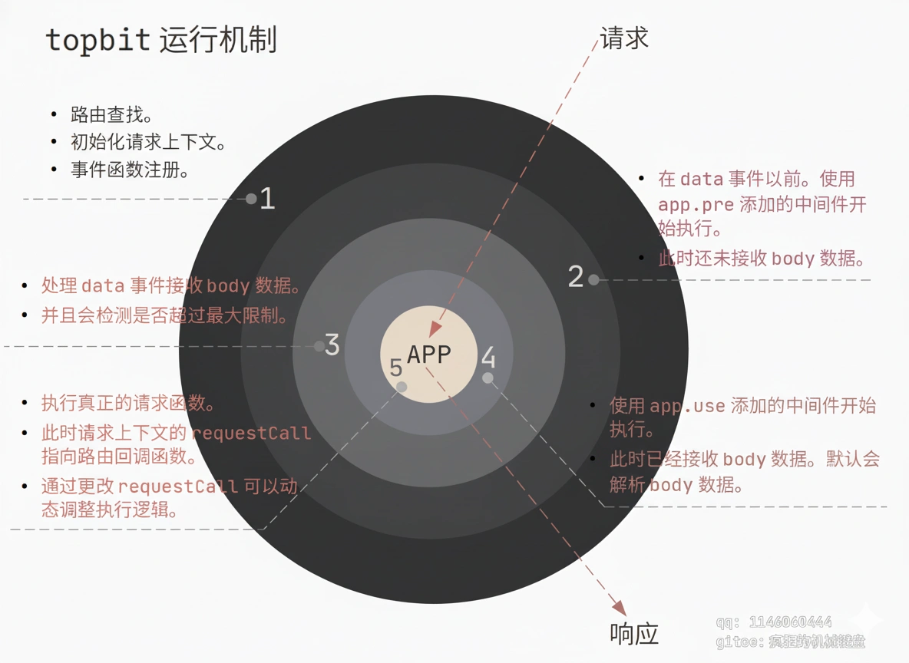

# Topbit

#### [🪭 中文文档 ☯️](README.cn.md)

Topbit is a server-side Web framework based on Node.js. It has no third-party dependencies and is optimized for extreme performance with a unique routing and middleware grouping execution mechanism.

**Core Features:**

*   **Request Context Design:** Shields interface differences.
*   **Global Middleware Pattern.**
*   **Route Grouping and Naming.**
*   **Group-Based Middleware Execution:** Middleware is matched and executed based on request methods and route groups.
*   **Daemon Mode:** Supports multi-process clustering and automated worker process load adjustment.
*   **Load Monitoring:** Displays child process load status.
*   **Body Parsing:** Parses body data by default.
*   **HTTP/1.1 & HTTP/2:** Supports enabling HTTP/1.1 or HTTP/2 via configuration. Allows simultaneous support for HTTP/2 and HTTP/1.1.
*   **HTTPS Support:** Supports HTTPS configuration (HTTP/2 service requires HTTPS).
*   **Request Limiting:** Limits the maximum number of visits per single IP within a specific time period.
*   **IP Blacklist and Whitelist.**
*   **Memory Management:** In cluster mode, monitors child processes and restarts them if they exceed the maximum memory limit.
*   **Auto-Scaling:** Optional automatic load mode: creates new child processes to handle requests based on load and restores the initial state when idle.
*   **Security:** Default settings related to network security to avoid DDoS attacks and other network security issues at the software service level.

## 📦Installation

```javascript
npm i topbit
```

You can also install via yarn:

```javascript
yarn add topbit
```

## Minimal Example

```javascript
'use strict'

const Topbit = require('topbit')

const app = new Topbit({
  debug: true
})

//in debug mode, output service info
app.printServInfo().run(1234)
```

When no routes are added, Topbit adds a default route:

`/*`

Visiting via a browser will show a very simple page. This is merely for initial understanding and documentation access; it will not affect actual development.

## Add a Route

``` JavaScript
'use strict'

const Topbit = require('topbit')

const app = new Topbit({
  debug: true
})


app.get('/', async ctx => {
  ctx.to('success')
})

// Defaults to listening on 0.0.0.0, parameters are consistent with the native listen interface.
app.printServInfo().run(1234)

```

`ctx.data` is the response data to be returned. You can also use `ctx.to(data)`.
> Actually, `ctx.to()` internally sets the value of `ctx.data`. **Using `ctx.to()` to set return data is recommended.**

## Using Import

In `.mjs` files, you can use ES6 import:

```javascript
import Topbit from 'topbit'

const app = new Topbit({
  debug: true
})

app.get('/', async ctx => {
    ctx.to('success')
})

app.printServInfo().run(1234)

```

## Routes and Request Types

The HTTP start line defines the request type, also known as the Request Method. Current request methods:
```
GET POST PUT PATCH DELETE OPTIONS  TRACE HEAD
```

The first 6 are the most commonly used. For each request type, the router has a corresponding lowercase function for mounting routes. For convenience, after initializing the app, you can use the shortcut calls with the same names on the `app` instance. (The framework supports these types.)

**Example:**

``` JavaScript

'use strict'

const Topbit = require('topibit')

const app = new Topbit({
  debug: true
})

app.get('/', async c => {
  c.to('success')
})

app.get('/p', async c => {
  c.to(`${c.method} ${c.routepath}`)
})

app.post('/', async c => {
  // Return uploaded data
  c.to(c.body)
})

app.put('/p', async c => {
  c.to({
    method : c.method,
    body : c.body,
    query : c.query
  })
})

// Defaults to listening on 0.0.0.0
app.printServInfo().run(8080)

```

## Get URL Parameters

- Query strings in the URL (parameters like `?a=1&b=2`) are parsed into `c.query`.
- Form submitted data is parsed into `c.body`.

> The content-type for forms is `application/x-www-form-urlencoded`.

``` JavaScript
'use strict';

const Topbit = require('topbit');

let app = new Topbit({
    debug: true
})

app.get('/q', async c => {
  // Query strings after ? in URL are parsed into query.
  // Returns JSON text, main difference is content-type in header is text/json
  c.to(c.query)
})

app.post('/p', async c => {
  // Data submitted via POST/PUT is saved to body. 
  // If it's a form, it is automatically parsed; otherwise, raw text value is saved.
  // Middleware can be used to handle various data types.
  c.to(c.body)
})

app.run(2019)

```

## Get POST Data

Requests that submit body data are POST and PUT. In front-end pages, this is usually form submission or asynchronous requests.

- Form submitted data is parsed into `c.body`.

> Form content-type is `application/x-www-form-urlencoded`.

> Asynchronous request data often has a content-type of `application/json`.

For both types above, `c.body` will be an object.

``` JavaScript
'use strict'

const Topbit = require('topbit')

let app = new Topbit({debug: true})

app.post('/p', async c => {
  // POST/PUT data saved to body. Forms are auto-parsed to object.
  // Middleware can be used to process various data.
  c.to(c.body)
});

app.run(2019)

```

## About content-type

**application/x-www-form-urlencoded**

Basic form types are parsed into `c.body` as a JS object.

**text/\***

If content-type is `text/*` (starts with text/), such as `text/json`, the framework does not parse it. It simply converts the uploaded data to a string in utf8 format and assigns it to `c.body`. Subsequent processing is decided by the developer.

**multipart/form-data;boundary=xxx**

If content-type is a file upload type, it is parsed by default. The parsed file objects are placed in `c.files`, accessible via `c.getFile`.

**application/json**

This type will be parsed using `JSON.parse`.

**Other types**

If content-type is any other type, `c.body` defaults to point to `c.rawBody`, which is the rawest Buffer data.

The framework provides basic core support. Other types need to be handled by the developer or via extensions.

To be easy to use while leaving enough space for developers, you can completely discard the default body parsing by setting the initialization option `parseBody` to `false`. You can also extend upon this.

The body parsing module is essentially a middleware designed to facilitate extension and replacement.

## to Function Returning Data

The `to` function is a wrapper for `c.data`; it sets the value of `c.data`. There are two aliases: `ok` and `oo`. You can choose freely based on the scenario.

``` JavaScript

app.get('/', async c => {
  c.to('success')
})

app.get('/randerr', async c => {
  let n = parseInt(Math.random() * 10)
  if (n >= 5) {
    c.ok('success')
  } else {
    // Return 404 status code
    /*
      Equivalent to:
        c.status(404).data = 'not found'
    */
   // You can use chain calls in versions above v22.4.6.
    c.status(404).oo('not found')
  }
})

app.run(1234)

```

## Chain Calls

You can use chain calls for `setHeader`, `status`, and `sendHeader`.

```javascript

app.get('/', async c => {

  c.setHeader('content-type', 'text/plain; charset=utf-8')
    .setHeader('x-server', 'nodejs server')
    .status(200)
    .to(`${Date.now()} Math.random()}`)

})

```

## Route Parameters

``` JavaScript
app.get('/:name/:id', async c => {
  // Use : to indicate route parameters, request params are parsed into c.param
  let username = c.param.name;
  let uid = c.param.id;
  c.to(`${username} ${id}`)
})

app.run(8000)
```

## Wildcard Path Parameters

`*` represents any path, but it must appear at the end of the route.

``` JavaScript

app.get('/static/*', async c => {
  // Any path represented by * is parsed into c.param.starPath
  let spath = c.param.starPath

  c.to(spath)
})

```

----

## Route Lookup Rules

----

The route lookup process strictly controls the order of parameterized routes and routes with `*`, rather than matching based on addition order.

Applications developed with previous versions are unaffected; there are no compatibility issues. Stricter ordering reduces the likelihood of conflicts.

Route Lookup Strategy:

1.  Ordinary string paths.
2.  Parameterized routes (routes with fewer parameters match first).
3.  Routes with `*` (matched in longest-to-shortest pattern).

```
Example:
Existing routes: /x/y/:id  /x/y/* /x/*  /x/:key/:id

/x/y/123 matches /x/y/:id first, stops matching.

/x/y/123/345 matches /x/y/* first, stops matching.

/x/q/123 will match /x/:key/:id.

/x/a.jpg will match /x/*, other routes cannot match.

/x/static/images/a.jpg will match /x/*, other routes cannot match.
```

----

## Grouping Routes

You can use `app.middleware` to specify middleware and use the returned `group` method to add grouped routes, or use `app.group` directly.

**topbit.prototype.middleware(mids, options=null)**

- `mids` is an array. Each element is a middleware function or an array where the first element is the middleware and the second is the options for adding that middleware.
- `options` defaults to `null`. Pass an object for options applying to all `mids`, e.g., `{pre: true}`.

**topbit.prototype.group(group_name, callback, prefix=true)**

- `group_name` is a string representing the route group name. If it is a valid path, it also serves as the route prefix.
- `callback` is a callback function. The parameters received by the callback can still call `middleware` and `group`, as well as `get`, `post`, etc., to add routes.
- `prefix` is a boolean, defaults to `true`. It controls whether `group_name` is added as a route prefix. However, it only acts as a prefix if `group_name` is a valid route string.

```javascript
'use strict'

const Topbit = require('topbit')

const app = new Topbit({
  debug: true
})

// Middleware function
let mid_timing = async (c, next) => {
  console.time('request')
  await next(c)
  console.timeEnd('request')
}

// The return value of group can use 'use' and 'pre' to add middleware.
// /api is also added to the route prefix.
app.group('/api', route => {
  route.get('/test', async c => {
    c.to('api test')
  })

  route.get('/:name', async c => {
    c.to(c.param)
  })
})

// Add middleware to the corresponding group
app.use(
  async (c, next) => {
    console.log(c.method, c.headers)
    await next(c)
  }, {group: '/sub'}
).group('/sub', route => {
  route.get('/:id', async c => {
    c.to(c.param.id)
  })
})

// Test: Does not conform to route rules, so it won't be a path prefix.
app.group('Test', route => {
  route.get('/test', async c => {
    console.log(c.group, c.name)
    c.to('test ok')
  }, 'test')
})

app.run(1234)

```

Specifying multiple middlewares in this way can be somewhat complex; you can use the `middleware` method. See the example below.

### Assigning Middleware to Groups and Subgroups

```javascript
'use strict'

const Topbit = require('topbit')
// Import ToFile extension
const {ToFile} = Topbit.extensions

const app = new Topbit({
  debug: true
})

// Middleware function
let mid_timing = async (c, next) => {
  console.time('request')
  await next(c)
  console.timeEnd('request')
}

let sub_mid_test = async (c, next) => {
  console.log('mid test start')
  await next(c)
  console.log('mid test end')
}

// group return value can use use, pre, middleware to add middleware.
// /api is also added to the route prefix.

app.middleware([
     // Time recording middleware, runs before receiving body data, so set pre: true
     [ mid_timing, {pre: true} ],

     // ToFile extension runs after receiving body data, only for POST and PUT requests
     [ new ToFile(), {method: ['POST', 'PUT']} ]
  ])
  .group('/api', route => {
      route.get('/test', async c => {
        c.to('api test')
      })

      route.get('/:name', async c => {
        c.to(c.param)
      })

      // Subgroup /sub enables middleware sub_mid_test.
      // Simultaneously, subgroups inherit all middleware from the upper layer.
      route.middleware([sub_mid_test])
        .group('/sub', sub => {
            sub.get('/:key', async c => {
              c.to(c.param)
            })
        })
  })

app.run(1234)

```

Groups support nested calls, but the hierarchy cannot exceed 9 levels. Usually, nesting more than 3 levels indicates a design issue and should be reconsidered.

**This feature is not as convenient and easy to use as the automatic loading mechanism of the `TopbitLoader` extension. However, in practice, requirements vary. Sometimes you have to use a single file for the service while still taking advantage of the framework's routing and middleware grouping, and also conveniently writing logic-clear, structured code. Therefore, `middleware` and `group` interfaces are convenient for handling this. Also, if you are not used to TopbitLoader's MCM pattern (Middleware - Controller - Model, similar to MVC), this method combines well with other module code.**

The function of assigning routing groups above is non-intrusive; it will not affect existing code, nor will it conflict with TopbitLoader.

**!! Complex route handling functions should be placed in separate modules and completed using a unified automated loading function.**

It supports adding via return values, so passing a callback function is not mandatory:

```javascript
'use strict'

const Topbit = require('topbit')
// Import ToFile extension
const {ToFile} = Topbit.extensions

const app = new Topbit({
  debug: true
})

// Middleware function
let mid_timing = async (c, next) => {
  console.time('request')
  await next(c)
  console.timeEnd('request')
}

let sub_mid_test = async (c, next) => {
  console.log('mid test start')
  await next(c)
  console.log('mid test end')
}

let route = app.middleware([
                // Time recording middleware, pre set to true
                [ mid_timing, {pre: true} ],

                // ToFile extension runs after receiving body data, only for POST and PUT
                [ new ToFile(), {method: ['POST', 'PUT']} ]
              ])
              .group('/api')

route.get('/test', async c => {
  c.to('api test')
})

route.get('/:name', async c => {
  c.to(c.param)
})

// Subgroup /sub enables middleware sub_mid_test.
// Subgroup inherits upper layer middleware.
route.middleware([sub_mid_test])
  .group('/sub', sub => {
      sub.get('/:key', async c => {
        c.to(c.param)
      })
  })

app.run(1234)

```

----

## Uploading Files

Uploaded files are parsed by default. You can turn this off by passing the `parseBody` option when initializing the service (detailed in options below).
Parsed file data is stored in `c.files`. The specific structure is shown later.

``` JavaScript
'use strict'

const Topbit = require('topbit')

const app = new Topbit()

app.post('/upload', async c => {
  
  let f = c.getFile('image')

  // Generate a unique filename based on original extension + timestamp + random number.
  let fname = c.ext.makeName(f.filename)

  try {
    c.to(await c.moveFile(f, fname))
  } catch (err) {
    c.status(500).to(err.message)
  }
  
}, 'upload-image'); // Name the route 'upload-image', accessible in c.name.

app.run(1234)

```

## c.files Data Structure

This structure is designed based on the data construction of HTTP protocol file uploads. HTTP protocol allows multiple files for the same upload name, so it parses into an array. Using `getFile` returns the first file by default, as usually, one upload name corresponds to one file.

> For the front-end, the upload name is the name attribute in the HTML form: `<input type="file" name="image">`.
> `image` is the upload name; do not confuse upload name with filename.

```javascript
{
  image : [
    {
      type: CONTENT_TYPE,
      filename: ORIGIN_FILENAME,
      start : START,
      end   : END,
      length: LENGTH,
      rawHeader: HEADER_DATA,
      headers: {...}
    },
    ...
  ],

  video : [
    {
      type: CONTENT_TYPE,
      filename: ORIGIN_FILENAME,
      start : START,
      end   : END,
      length: LENGTH,
      rawHeader: HEADER_DATA,
      headers: {...}
    },
    ...
  ]
}
```

`c.getFile` indexes by name. The default index value is 0. If a number less than 0 is passed, it gets the entire file array; returns null if not found.

## Max Body Data Limit

```javascript
'use strict'

const Topbit = require('topbit')

const app = new Topbit({
  // Allows POST or PUT request data max value to be approx 20MB.
  // Unit is bytes.
  maxBody: 20000000
})

//...

app.run(1234)

```

## Middleware

Middleware is a very useful pattern. Implementation varies slightly between languages, but the essence is the same. The middleware mechanism allows developers to organize code better and implement complex logic easily. In fact, the entire framework runs on a middleware pattern.

Middleware Diagram:


This framework's middleware is designed to distinguish by route groups and recognize different request types to determine whether to execute or skip to the next layer. This makes it extremely fast. Multiple routes and groups have their own middleware, do not conflict, and avoid meaningless calls. Reference format:

``` JavaScript

/*
  The second parameter is optional; omitting it enables the middleware globally.
  Here, the second parameter indicates: execute only for POST requests AND the route group must be /api.
  This design ensures execution on demand, avoiding unnecessary operations.
*/
app.add(async (c, next) => {
    console.log('before');
    await next(c);
    console.log('after');
}, {method: 'POST', group: '/api'});

```

Middleware added with `add` executes in reverse order of addition (LIFO), which is the standard onion model. To provide logic that is easier to understand, the `use` interface is provided. Middleware added with `use` executes in the order of addition (FIFO). Different frameworks have different logic for order implementation, but sequential execution suits developer habits better.

**It is recommended to use `use` to add middleware:**

``` JavaScript
// Executes first
app.use(async (c, next) => {
  let start_time = Date.now()
  await next(c)
  let end_time = Date.now()
  console.log(end_time - start_time)
})

// Executes later
app.use(async (c, next) => {
  console.log(c.method, c.path)
  await next(c)
})

// use can be cascaded: app.use(m1).use(m2)
```

## Topbit Complete Flow Chart



> **It is important to know that internally, body data reception and parsing are also middleware. The order is deliberately arranged, separating `pre` and `use` interfaces.**

## Middleware Parameters

Using `use` or `pre` interfaces to add middleware supports a second parameter for precise control via option properties:

*   `group`: Route group. Indicates which group to execute for.
*   `method`: Request method. String or Array, must be uppercase.
*   `name`: Request name. Indicates execution only for this request name.

Example:

```javascript

app.get('/xyz', async c => {
  //...
  // Route group named proxy
}, {group: 'proxy'})

app.use(proxy, {
  method : ['PUT', 'POST', 'GET', 'DELETE', 'OPTIONS'],
  // Execute for requests in route group 'proxy'.
  group : 'proxy'
})
```

## pre (Before Receiving Body Data)

The main difference between middleware added via the `pre` interface and `use` is that `pre` executes before receiving body data. It can be used for permission filtering operations before receiving data. Its parameters are consistent with `use`.

For a consistent development experience, you can use the `use` interface and simply specify `pre` in the options:

```javascript
let setbodysize = async (c, next) => {
    // Set max body receive data to ~10k.
    c.maxBody = 10000;
    await next(c);
};

// Equivalent to app.pre(setbodysize);
app.use(setbodysize, {pre: true});

```

Using `pre` allows for more complex processing, including intercepting and not executing the next layer. For example, the `proxy` extension uses this feature to implement a high-performance proxy service directly as a framework middleware. Its main operation is to set the request's `data` event to receive data at this layer, handle other logic, and return directly.

**Dynamically limiting request body size based on different request types**

This requirement can be solved by adding middleware via `pre`:

```javascript

const app = new Topbit({
  // Default max body limit ~10M.
  maxBody: 10000000
})

app.pre(async (c, next) => {

  let ctype = c.headers['content-type'] || ''

  if (ctype.indexOf('text/') === 0) {
    // 50K
    c.maxBody = 50000
  } else if (ctype.indexOf('application/') === 0) {
    // 100K
    c.maxBody = 100000
  } else if (ctype.indexOf('multipart/form-data') < 0) {
    // 10K
    c.maxBody = 10000
  }

  await next(c)

}, {method: ['POST', 'PUT']})


```

If these parameters appear in the file simultaneously, it can look complex and be hard to maintain, but the functionality is powerful. Therefore, leaving it to automated program completion can greatly simplify coding.

**For complete project structure setup, please use `topbit-loader`. This extension completes automatic loading of routes/models and automatic orchestration of middleware. <a target=_blank href="https://gitee.com/daoio/topbit-loader">topbit-loader</a>**

## HTTPS

```javascript
'use strict'

const Topbit = require('topbit')

// Just pass the path to the certificate and key files
const app = new Topbit({
    // './xxx.pem' file also works
    cert: './xxx.cert',
    key: './xxx.key'
})

app.run(1234)

```

## Simultaneous Support for HTTP/2 and HTTP/1.1 (Compatibility Mode)

Compatibility mode utilizes the ALPN protocol and requires HTTPS, so certificates and keys must be configured.

```javascript
'use strict'

const Topbit = require('topbit')

// Just pass the path to the certificate and key files
const app = new Topbit({
    cert: './xxx.cert',
    key: './xxx.key',
    // Enable http2 and allow http1; compatibility mode is enabled automatically
    http2: true,
    allowHTTP1: true
})

app.run(1234)

```

## Configuration Options

Full configuration options for app initialization are as follows. Please read the comments carefully.

``` JavaScript
  {
    // This config represents max bytes for POST/PUT form submission and file uploads.
    maxBody   : 8000000,

    // Max number of files to parse
    maxFiles      : 12,

    daemon        : false, // Enable daemon mode

    /*
      After enabling daemon mode, if path is not empty string, pid is written to this file. Used for service management.
    */
    pidFile       : '',

    // Whether to enable global logging. true enables it, outputting request info or writing to file.
    globalLog: false,

    // Log output type: 'stdio' for terminal, 'file' for file output.
    logType : 'stdio',

    // File path for successful request logs
    logFile : '',

    // File path for error request logs
    errorLogFile : '',

    // Max lines per log file
    logMaxLines: 50000,

    // Max number of historical log files
    logHistory: 50,

    // Custom log handler function
    logHandle: null,

    // Enable HTTPS
    https       : false,

    http2   : false,

    allowHTTP1: false,

    // HTTPS key and cert file paths. If paths are set, https is automatically set to true.
    key   : '',
    cert  : '',

    // Server options written in 'server', passed during http service initialization. Reference http2.createSecureServer, tls.createServer
    server : {
      handshakeTimeout: 8192, // TLS handshake timeout
      //sessionTimeout: 350,
    },

    // Set server timeout in ms. Specific request timeouts can be set in specific requests.
    timeout   : 15000,

    debug     : false,

    // Ignore trailing / in paths
    ignoreSlash: true,

    // Enable request limiting
    useLimit: false,

    // Max connections, 0 means no limit
    maxConn : 1024,

    // Max connections per single IP within unit time, 0 means no limit
    maxIPRequest: 0,

    // Rate limit unit time for IP, 1 means 1 second. Default 60 seconds. Range 0.1 ~ 86400.
    unitTime : 60,
    
    // Display load info, requires enabling cluster mode via daemon interface
    loadMonitor : true,

    // Load info type: text, null, obj, orgobj
    // json type is for program communication, convenient for interface development
    loadInfoType : 'text',

    // Load info file path. If not set, outputs to terminal; otherwise saves to file.
    loadInfoFile : '',

    // Data to return for 404
    notFound: 'Not Found',
    
    // Data to return for 400
    badRequest : 'Bad Request',

    // Percentage parameter controlling max memory usage for child processes. Range -0.42 ~ 0.36. Base is 0.52, so default is 80%.
    memFactor: 0.28,

    // Max URL length
    maxUrlLength: 2048,

    // Max number of request context cache pool.
    maxpool: 4096,

    // Timer milliseconds for child process resource reporting.
    monitorTimeSlice: 640,

    // When globalLog is true, record real IP address? Mainly used in reverse proxy mode.
    realIP: false,

    // Max allowed querystring parameters.
    maxQuery: 25,

    // Enable strong mode? If enabled, processes rejectionHandled and uncaughtException events,
    // and captures errors: TypeError,ReferenceError,RangeError,AssertionError,URIError,Error.
    strong: false,

    // Fast querystring parsing. Multiple values with same name only set the first one, not parsed as array.
    fastParseQuery: false,
    
    // Whether to auto decode Query parameters using decodeURIComponent.
    autoDecodeQuery: true,

    // In multipart format, limit max length of a single form item.
    maxFormLength: 1000000,

    /* Error handler function. Unifies collection of runtime errors:
          tlsClientError, server error, secureConnection error, clientError, thrown runtime errors.
      errname is a string marking error info and location, format --ERR-CONNECTION--, --ERR-CLIENT--, etc.

      Usually Node.js thrown errors have code and message. 
      errname is optional but passed.
      Pass custom function via config option to implement custom error collection/handling.
    */
    errorHandle: (err, errname) => {
      this.config.debug && console.error(errname, err)
    },

    // Max load rate percentage. Default 75 means if CPU usage > 75%, automatically create child process.
    // Must enable auto load mode via autoWorker.
    maxLoadRate: 75,

    // http2 protocol http2Stream timeout. If not set, -1 means consistent with timeout.
    streamTimeout: -1,

    // Request timeout. This is total request time, mainly to counter malicious requests.
    // e.g. Slowloris attacks where 1 byte is sent per second.
    // Idle timeout won't work, allowing long-term resource occupation.
    // This is a DDoS attack.
    requestTimeout: 100000,

  };
  // For HTTP status codes, only these two are needed here. Others don't strictly need full support, 
  // and you can handle them in your application implementation.
  // Because once execution starts, corresponding status codes can be returned via runtime state.
  // Before that, the framework prepares for the onion model execution, which is very fast.

```

## Request Context

Request context is an object encapsulating various request data. This design handles differences between HTTP/1.1 and HTTP/2 protocols and incompatibilities from Node.js evolution. For design and performance, the HTTP2 module encapsulates the request object as a stream, not the `http` module's `IncomingMessage` and `ServerResponse`.

**Request Context Properties and Description**

| Property | Description |
| ---- | ---- |
| version | Protocol version, string type, '1.1' or '2'. |
| major | Major protocol version number, 1, 2, 3 (HTTP/1.1, HTTP/2, HTTP/3). |
| maxBody | Max supported request body bytes. Number. Defaults to `maxBody` init option. Can be set automatically in middleware based on request. |
| method | Request type (GET, POST, etc.). Uppercase string. |
| host | Service hostname, value of `request.headers.host`. |
| protocol | Protocol string without colon, 'https', 'http'. |
| path | Specific request path. |
| routepath | Actual executed route string. |
| query | URL passed parameters. |
| param | Route parameters. |
| files | Uploaded file information. |
| body | Body request data. Format depends on content-type (string, object, buffer). |
| port | Client request port number. |
| ip | Client request IP address (socket address). Check x-real-ip or x-forwarded-for if using proxy. |
| headers | Points to `request.headers`. |
| isUpload() | Is it a file upload request? Checks if content-type header is multipart/form-data. |
| name | Route name, defaults to empty string. |
| group | Route group, defaults to empty string. |
| res | HTTP/1.1 points to response, HTTP/2 points to stream. |
| req | HTTP/1.1 is `IncomingMessage` object, HTTP/2 points to stream object. |
| box | Defaults to empty object. Can add any property value to dynamically pass info to next layer components. |
| service | Object for dependency injection, points to `app.service`. |
| data | Saves final data to return to client. Assign to data or use `ctx.to`. Pre-v24.x was `ctx.res.body`. |
| ext | Provides helper functions. See wiki. |
| to(data) | Function to set `ctx.data`. |
| write(data) | Directly write data to client. |
| moveFile(file:object, target_filepath:string) | Function to move uploaded file to specified path. |
| status() | Function to set status code. |
| setHeader(k, v) | Function to set header. |
| removeHeader(k) | Function to remove header waiting to be sent. |
| getFile(name) | Function to get uploaded file info (reads files property). |
| sendHeader() | Function to send headers for http2. `setHeader` only caches headers. For http/1.1, this is an empty function for code consistency. |
| user | Standard property for user login, defaults to null. |
| json(data) | Function, sets return data and marks type as json. |
| text(data) | Function, sets return data and marks type as text. |
| html(data) | Function, sets return data and marks type as html. |
| pipe(filepath) | Function, stream response data. Example: `await ctx.setHeader('content-type', 'text/html').pipe('./index.html')` |
| pipeJson(filepath) | Stream file data as json type. |
| pipeText(filepath) | Stream file data as text type. |
| pipeHtml(filepath) | Stream file data as html type. |

Note: `to` function only sets `ctx.data` value; data is returned at the end. It's same as direct assignment, but function calls reveal errors faster (wrong assignment adds a property without error but returns incorrect data).

## Dependency Injection

The request context has a `service` item pointing to `app.service`. After initializing the app, all data/instances needed can be mounted to `app.service`.

``` JavaScript

'use strict';

const Topbit = require('topbit');

let app = new Topbit({
  debug: true
});

// Overwrites if exists, adds if not.
app.addService('name', 'first');
app.addService('data', {
  id : 123,
  ip : '127.0.0.1'
});

/*
This might seem useless in a single file where variables are accessible.
However, it becomes very important for module separation.
*/
app.get('/info', async c => {
  c.to({
    name : c.service.name,
    data : c.service.data
  })
})

app.run(1234)

```

## Extending Request Context

To add extension support to the request context object, use `app.httpServ.context`. This property is the constructor for the request context.

**Example:**

```javascript
'use strict'

const Topbit = require('topbit')

const app = new Topbit({
    debug: true
})

// 'this' represents the request context
app.httpServ.context.prototype.testCtx = function () {
    console.log(this.method, this.path)
}

app.get('/test', async ctx => {
    ctx.testCtx()
})

app.run(1234)

```

## app.isMaster and app.isWorker

Node.js v16.x recommends `isPrimary` over `isMaster`. However, `isMaster` is still available. After Topbit initialization, `app` has two getters: `isMaster` and `isWorker`. They function identically to `cluster` properties. Purposes:

- Avoid writing `const cluster = require('cluster')` again.
- Shield future incompatible changes in `cluster`, enhancing code compatibility.

## daemon and run

`run` parameters: `port`, `host`. `host` defaults to `0.0.0.0`. Can also be `sockPath` (path to .sock file), supported by http listen interface. Using .sock ignores host.

`daemon` first two parameters match `run`. Third parameter is a number indicating how many child processes to use. Defaults to 0, which automatically creates child processes based on CPU core count. It maintains stable child process count, creating new ones if any terminate unexpectedly.

**In cluster mode, max child processes will not exceed 2x CPU cores.**

Example:

```javascript

// Host defaults to 0.0.0.0, port 1234
app.run(1234)

// Listen on localhost, only accessible locally
app.run(1234, 'localhost')

// Use 2 child processes, host defaults to 0.0.0.0
app.daemon(1234, 2)

// Use 3 child processes
app.daemon(1234, 'localhost', 3)

```

## Logging

The framework provides global logging. When using cluster mode (`daemon` interface), use initialization option `globalLog` to enable global logs and specify a log file. In single process mode, logs output to terminal (can use output/error redirection to save to file).

**Note: Only daemon execution (cluster mode) allows saving logs to file natively. `run` (single process) outputs to screen; use IO redirection to save.**

Besides file saving and terminal output, `logHandle` option allows custom log processing functions.

**Setting `logHandle` invalidates `logFile` and `errorLogFile`. See code for details.**

Example:

``` JavaScript

const Topbit = require('topbit')

const app = new Topbit({
  debug: true,
  // Enable global log
  globalLog: true,

  // Output to file. Default is 'stdio' (terminal).
  logType: 'file'

  // Log file for status codes 2xx or 3xx
  logFile : '/tmp/topbit.log',

  // Log file for errors (4xx or 5xx)
  errorLogFile: '/tmp/topbit-error.log',

  // Custom handler function. logFile/errorLogFile become invalid.
  // Parameters: (worker, message)
  // worker: see cluster worker docs
  /*
    msg is log object, properties:
      {
        type : '_log',
        success : true,
        log : '@ GET | https://localhost:2021/randst | 200 | 2020-10-31 20:27:7 | 127.0.0.1 | User-Agent'
      }
  */
  logHandle : (w, msg) => {
    console.log(w.id, msg)
  }

})

app.daemon(1234, 3)

```

Using middleware for logging does not conflict with global logging. However, middleware logging cannot capture 404s returned by the framework when no route matches (as context is not created to avoid overhead).

Furthermore, this method integrates better with cluster mode as it uses master-worker communication internally.

## Message Event Handling

Based on the `message` event, in daemon mode (based on cluster module), a `setMsgEvent` function is provided to handle events sent by child processes.

This requires the message sent by worker processes to be an object, with a mandatory `type` property indicating the event name. Other fields can be custom.

Usage:

``` JavaScript

const Topbit = require('topbit')
const cluster = require('cluster')

const app = new Topbit({
  debug: true,
  loadInfoFile: '/tmp/loadinfo.log'
})

if (cluster.isMaster) {
  app.setMsgEvent('test-msg', (worker, msg, handle) => {
    // Child process receives message via message event
    worker.send({
      id : worker.id,
      data : 'ok'
    })

    console.log(msg)
  })
} else {
  // Receive message sent by worker.to
  process.on('message', msg => {
    console.log(msg)
  })

  setIneterval(() => {
    process.send({
      type : 'test-msg',
      pid : process.pid,
      time : (new Date()).toLocaleString()
    })
  }, 1000)

}

```

Sending messages from worker processes is complex. Since version 22.4.0, a `send` method is provided for quick message sending. It only sends to master from a worker process, so no extra worker check is needed.

## app.send and app.workerMsg

Let's rewrite the worker message sending part of the code above:

```javascript

const Topbit = require('topbit')

const app = new Topbit({
  debug: true,
  loadInfoFile: '/tmp/loadinfo.log'
})

// Master process registers message event type. Worker process ignores this.
app.setMsgEvent('test-msg', (worker, msg, handle) => {
  // Child process receives message via message event
  worker.send({
    id : worker.id,
    data : 'ok'
  })

  console.log(msg)
})

// Only worker process listens.
app.workerMsg(msg => {
  console.log(msg)
})

cluster.isWorker
    &&
setInterval(() => {
  // Only worker executes.
  app.send('test-msg', {
    pid: process.pid,
    time: (new Date).toLocaleString()
  })

}, 1000)

app.daemon(1234, 2)

```

## Automatically Adjusting Child Process Quantity

The parameter passed to `daemon` sets the base number of child processes, e.g.:

``` JavaScript

// Use 2 child processes to handle requests.
app.daemon(1234, 2)

```

To automatically create child processes based on load and terminate them when idle (maintaining base quantity), use `autoWorker` to set a maximum value. This value must be larger than the base quantity to take effect.

```javascript

// Max 9 child processes.
app.autoWorker(9)

//...

app.daemon(1234, 2)

```

When load is high, child processes are created. After a period of idleness, processes with 0 connections are terminated, restoring the base number.

**Available in v21.9.6+. Please use the latest version as this feature has been improved for stability and performance in subsequent versions.**

----

## 🛡️Strong Mode

Enable strong mode via the `strong` option. This monitors `uncaughtException` and `unhandledRejection` events to ensure stable operation. Simplest usage: set `strong` to `true`.

**All strong mode features can be implemented via the `process` module; this just simplifies it.**

```javascript
'use strict';

const Topbit = require('topbit');

setTimeout(() => {
  // Throw exception inside timer loop
  throw new Error(`test error`)
}, 2000);

const app = new Topbit({
    // Debug mode, output errors.
    debug: true,
    // Enable strong mode
    strong: true
});

app.run(1234);

```

By default, strong mode captures:

```
'TypeError', 'ReferenceError', 'RangeError', 'AssertionError', 'URIError', 'Error'
```

You can customize handling by passing an object to `strong`.

```javascript

// Core code example
const app = new Topbit({
    // Debug mode, output errors.
    debug: true,
    // Enable strong mode
    strong: {
      // Silent behavior, no error output.
      quiet: true,
      // Custom error handler
      errorHandle: (err, errname) => {
        //....
      },

      // Which errors to catch
      catchErrors: [
        'TypeError', 'URIError', 'Error', 'RangeError'
      ]

    }
})

```

## 🔔Simultaneous HTTP and HTTPS?

Note the question mark. You shouldn't do this in production. If HTTPS is enabled, HTTP isn't needed, and some frontend features won't work without HTTPS.

If needed (perhaps for testing), do this:

```javascript
'use strict'

const Topbit = require('topbit')
const http = require('node:http')
const https = require('https')

const app = new Topbit({
    // Enable debug
    debug: true,
})

// Below are http/1.1 services. For http2, enable http2 and compatibility mode.
// Or use topbit-httpc extension.

// In this case, you must set event listeners manually.

let http_server = http.createServer(app.httpServ.onRequest())
let https_server = https.createServer(app.httpServ.onRequest())

http_server.listen(2025)
https_server.listen(2026)

```

**Note: You cannot support http2 in this scenario, but you can use http2 to be compatible with http1.**

## Request Limiting

The framework provides IP-based rate limiting to prevent dense requests from the same IP. For HTTP/2, use `http2limit` module from `topbit-toolkit`.

```javascript
'use strict';

const Topbit = require('topbit')

const app = new Topbit({
    debug : true,
    // Enable request limiting
    useLimit: true,

    // IPs allowed without frequency limit
    allow: new Set(['127.0.0.1']),

    // IPs to deny
    deny: (ip) => {
      // Example only, supports function and Set
      if (ip.indexOf('1.') === 0) return false
      return true
    },
    
    // Max requests per IP within unit time
    maxIPRequest: 6,
    
    // Unit time, 15 seconds
    unitTime: 15,
    
    // Max concurrent connections per worker process
    maxConn: 2000,

    loadMonitor: true,
    loadInfoType : 'text',
    globalLog : true,
    logType: 'stdio',
    // Load info in memory
    loadInfoFile : '--mem'
})


app.get('/', async ctx => {
  ctx.to('ok')
})

// Use 3 worker processes. Each allows 6 requests/unit time.
// Total approx 6 requests? Set maxIPRequest to 2.
app.daemon(1234, '0.0.0.0', 3)

```

## Other

- After running, Topbit has a final wrapper middleware. Setting `c.data` returns data. It detects simple text types and sets content-type automatically (text/plain, text/html, application/json) if not set.

- Defaults to limiting max URL length and sets a max memory usage rate based on hardware.

- All of this can be extended/overridden via config options or middleware.

- It is fast, and we focus on optimization. If comparing, add multiple middleware and hundreds of routes to test.

- Provides a `sched` function to quickly set cluster scheduling policy ('rr' or 'none'). Sets `cluster.schedulingPolicy`.

The framework automatically detects memory size and sets limits on initialization. You can change limits via properties in `secure` after init, but this requires using `daemon` (master managing workers).

```javascript
'use strict'

const Topbit = require('topbit');

let app = new Topbit();

/*
 Operations below can be controlled via memFactor option. See config options above.
 */

// Max memory 600M, auto restart only when connection count is 0.
app.secure.maxmem = 600_000_000;

// Mandatory restart max memory limit 900M. Total memory usage including Buffers.
// Must be larger than maxmem. If memory > maxmem AND connections != 0, 
// AND continues to exceed diemem, process restarts immediately.
app.secure.diemem = 900_000_000;

// Max RSS memory 800M. Program memory usage, excluding Buffer allocations.
app.secure.maxrss = 800_000_000;

app.get('/', async c => {
  c.to('ok');
})

app.daemon(8008, 2);

```

**Note: Requires `loadMonitor` option (enabled by default).**

Here is the English translation of the document:

---

# 🧩 Middleware Extensions and Other Extensions 📜

---

As a Web framework, providing only basic functionality is not enough. Many basic functions are used across all Web services, which inevitably leads to the creation of universal extension modules.

In Topbit's global middleware design mechanism, most web service-related extensions can be completed by developing a middleware extension. You can refer to the `Middleware` section; this plugin mechanism is extremely flexible.

**Topbit provides several universal middleware extensions that developers can use as needed.**

**It also provides other extension modules: Route Loader, Token Session Verification, Command Argument Parsing, Automatic Error Log Processing, and ZIP compression/decompression.**

## Importing Middleware Extensions

All middleware extensions are located under `Topbit.extensions`. Example:

```javascript
'use strict'

process.chdir(__dirname)

const Topbit = require('Topbit')

// Import extensions via destructuring assignment
const {Cors, ToFile} = Topbit.extensions

const app = new Topbit({
  debug: true,
  // Enable logging, alias for globalLog
  log: true
})

// CORS extension runs before body parsing
// Middleware added via 'use' runs after body data parsing
app.pre(new Cors())
  .use(new ToFile, {method: ['PUT', 'POST']})

app.post('/file', async ctx => {
  let f = ctx.getFile('file')
  if (!f) return ctx.status(400).to('file not found')

  ctx.to(
    await f.toFile('./uploads')
  )
})

app.run(1235)
```

## ☲ Middleware Extensions

| Middleware | Description |
| :--- | :--- |
| **Cors** | Middleware to support Cross-Origin Resource Sharing (CORS). |
| **Resource** | Static resource processing; a powerful service for serving static files. |
| **ToFile** | Equips uploaded file objects with a `toFile` method. |
| **SSE** | SSE (Server-Sent Events) protocol middleware for HTTP-based data streaming. |
| **Proxy** | Reverse proxy for the HTTP/1.1 protocol, supporting load balancing and alive checks. |
| **Http2Proxy** | Reverse proxy for the HTTP/2 protocol, supporting load balancing and alive checks. |
| **SNI** | Support for multi-domain HTTPS (Server Name Indication). |
| **ParamCheck** | Request parameter validation, supporting checks for `param`, `query`, and `body`. |
| **JWT** | Token verification using the JWT protocol. (Note: `Topbit.Token` is recommended instead as it is much stronger than JWT). |
| **Cookie** | Parses cookies from the frontend request headers. |
| **Session** | Session management using a local file mechanism. |

---

### 1. Cors (Cross-Origin Support)

Middleware that supports cross-origin requests. It supports cross-origin communication via the `origin` header as well as resource inclusion via `referer`, allowing for flexible selection and configuration.

**Basic Usage:**

```javascript
const Topbit = require('topbit')
const {Cors} = Topbit.extensions

let cr = new Cors({
    // Defaults to *, meaning cross-origin is enabled for all.
    // If you want to specify supported domains, pass an array.
    // Note: This specifies the domain of the application page accessing the API.
    allow : [
        'https://a.com',
        'https://www.a.com',
    ],

    // Defaults to content-type only
    allowHeaders : 'authorization,content-type',

    // Caches OPTIONS requests for 60 seconds; the browser will read from cache during this period.
    optionsCache: 60,

    // Defaults to '*', sets allowed request methods.
    // requestHeaders : '*'

    // Defaults to '', indicating which headers can be exposed to the requester. Multiple headers are separated by commas.
    // exposeHeaders: 'x-test-key,x-type'
})

app.pre(cr)

// Supports OPTIONS requests. Browsers send an OPTIONS preflight request before processing POST/PUT/DELETE.
// You must handle OPTIONS requests to fully support CORS.
app.options('/*', async c => {})
```

**Advanced Configuration (Referer Check & Grouping):**

```javascript
let cr = new cors({
  // Do not allow empty referer
  allowEmptyReferer: false,

  // Route groups that allow empty referer.
  // Group names are custom; refer to the framework's route grouping feature.
  // This is mainly used when API development also needs to serve pages.
  emptyRefererGroup: [
    '@webapp', '@pages'
  ],

  allow: [
     // Default string format allows both origin cross-domain and referer external linking
    'https://w.a.com',
    'https://w.x.cn',

    {url: 'https://servicewechat.com/wx234hiohr23', referer: true},
    // Not applied to referer check; if a request submits referer as self-define, it will not pass
    {url: 'self-define', referer: false}
  ],
})
```

---

### 2. Resource (Static Resource Processing)

Static resource processing service, mainly used for hosting JS, CSS, images, audio, and other static files. Supports cache control, route prefix correction, and more.

**Basic Usage:**

```javascript
const Topbit = require('topbit')
const {Resource} = Topbit.extensions

let st = new Resource({
    // Set the directory where static resources are located
    staticPath: './public'
})

// Execute middleware only for the 'static' group.
app.use(st, {group: 'static'})

// Add static resource route. Assuming 'css/a.css' exists in the 'public' directory.
// Access via /static/css/a.css
app.get('/static/*', async c => {
    // Request is in group 'static'
}, '@static')
```

**Quick Example & Configuration Details:**

```javascript
let st = new Resource({
    // Set the directory where static resources are located
    staticPath: './public',

    // Route path: Frontend must start with /static/, mapping to files in ./public
    routePath : '/static/*',

    // Specify route group
    routeGroup: '_static',

    // Whether to support decoding of Chinese paths (default false)
    decodePath: true,

    // Prefix path correction. If set to xyz, it automatically corrects to /xyz.
    // prepath : '',

    // Maximum file size to cache (in bytes); files larger than this will not be cached.
    maxFileSize: 12_000_000,

    // Set the value of the cache-control header, defaults to null
    cacheControl: 'max-age=3600',
    
    // Maximum total cache size (default 120MB)
    maxCacheSize: 120_000_000,

    // Failure limit and cache release probability
    failedLimit: 50,
    prob: 6
})

st.init(app)

// Automatically added to the _static group.
// Example: If favicon.ico is in the public directory, it can be accessed via this request.
app.get('/favicon.ico', async c => {}, {group: '_static'})
```

**Interface Description:**
*   `addType(obj)`: Add mapping from extension to content-type.
*   `clearCache()`: Clear the cache.

---

### 3. ToFile (File Upload Objectification)

Equips uploaded file objects with a `toFile` method, facilitating file saving in an object-oriented style.

```javascript
const Topbit = require('topbit')
const {ToFile} = Topbit.extensions

app.use( new ToFile() )

app.post('/upload', async c => {
    // Get the uploaded file object
    let f = c.getFile('image')

    if (!f) {
        return c.status(400).oo('image file not found')
    }

    // Move the file to the 'images' directory (ensure the directory exists).
    // The second parameter is optional to specify a filename; defaults to a unique name based on timestamp and random number.
    let fname = await f.toFile('./images')

    // Return filename
    c.ok(fname)
})

app.run(1234)
```

---

### 4. SSE (Server-Side Messaging)

Server-Sent Events (SSE) middleware based on the HTTP protocol, used for the server to proactively push data streams to the client.

**Basic Usage:**

```javascript
const Topbit = require('topbit')
const {SSE} = Topbit.extensions

let s = new SSE({
  // Timeout 20 seconds; connection closes automatically after this time
  timeout: 20000,

  // Reconnection time; default is 0 meaning do not reconnect
  retry: 5000,

  // Timer interval; execute the handler function every 2 seconds
  timeSlice: 2000
})

// Set handler function, ctx is the request context
s.handle = (ctx) => {
    // Send a single message
    ctx.sendmsg({event: 'eat', data: 'Rice'})
    
    if (Date.now() % 5 === 0) {
        // Send multiple messages. Strings or numbers are automatically converted to message format.
        // Default event is 'message'.
        ctx.sendmsg([
            {event: 'clock', data: Date.now()},
            'May we all be blessed with longevity.',
            Math.random()
        ])
    }
}

// Enable middleware only for route group 'sse'
app.use( s, {group: 'sse'} )

app.get('/sse', async ctx => {}, {group: 'sse'})

app.run(1234)
```

**Generator Mode:**
Suitable for scenarios requiring dynamic interval adjustment or precise control.

```javascript
let s = new SSE({
  timeout: 20000,
  retry: 5000,
  timeSlice: 10,
  mode: 'yield' // Enable generator mode
})

s.handle = (ctx) => {
    ctx.sendmsg({event: 'eat', data: 'Rice'})
    // Use await ctx.sse.moment(ms) for delay
    await ctx.sse.moment(100)
}
```

---

### 5. Proxy (HTTP/1.1 Reverse Proxy)

Reverse proxy for HTTP/1.1 protocol, supporting load balancing and Alive Check.

**Basic Proxy Configuration:**

```javascript
const Topbit = require('topbit')
const {Proxy} = Topbit.extensions

let hostcfg = {
    // Simple mapping: default path is /
    'a.com' : 'http://localhost:8001',

    // Specific path mapping
    'b.com' : {
        path : '/xyz',
        url : 'http://localhost:8002'
    },

    // Complex config and rewrite
    'c.com' : [
        {
            path : '/',
            url : 'http://localhost:8004',
            rewrite: (ctx, path) => {
              // Custom route rewrite rules
              if (path.indexOf('/xyz') === 0) {
                return path.replace('/xyz', '/w')
              }
            }
        }
    ]
};

const pxy = new Proxy({
    timeout: 10000,
    config: hostcfg
})

pxy.init(app)

app.run(1234)
```

**Load Balancing Configuration:**
Implemented via configuration arrays, supporting `weight` and alive checks.

```javascript
let load_balance_cfg = {
    'a.com' : [
        {
            path : '/',
            url : 'http://localhost:1234',
            // Check service liveness every 3 seconds
            aliveCheckInterval : 3,
            aliveCheckPath : '/alive-check',
            // Weight: larger numbers mean higher weight
            weight: 3
        },
        {
            path : '/',
            url : 'http://localhost:1235',
            aliveCheckInterval : 3,
            aliveCheckPath : '/ok',
            weight: 2
        }
    ]
}

const pxy = new Proxy({
    timeout: 10000,
    starPath : true, // If enabled, forwards the string after the proxy path as the path
    config: load_balance_cfg
})

pxy.init(app)
```

---

### 6. Http2Proxy (HTTP/2 Reverse Proxy)

Reverse proxy for HTTP/2 protocol. Parameters are basically the same as `Proxy`, using HTTP/2 connection mechanisms for keep-alive.

```javascript
const Topbit = require('topbit')
const {Http2Proxy} = Topbit.extensions

let hxy = new Http2Proxy({
  config: {
    'a.com' : [
      {
        url: 'http://localhost:3001',
        weight: 10,
        path : '/',
        reconnDelay: 200, // Reconnection delay
        maxConnect: 2,
        headers: {
          'x-test-key': `${Date.now()}`
        },
        connectTimeout: 2000
      },
      {
        url: 'http://localhost:3002',
        weight: 4,
        path : '/'
      }
    ]
  },
  debug: true
})

hxy.init(app)

app.run(1234)
```

---

### 7. SNI (HTTPS Multi-Domain Support)

**Description**: Middleware to support multiple HTTPS domain certificates on the same IP address and port. It uses the TLS protocol's Server Name Indication feature to dynamically load the corresponding SSL certificate based on the domain requested by the client.

**Note**: Certificates are read synchronously during initialization; please ensure paths are correct. If a certificate for a domain fails to read, an error will be output to the console, but it will not block the loading of other domains.

**Usage:**

```javascript
const Topbit = require('topbit')
const {SNI} = Topbit.extensions

const app = new Topbit({
    // Enable HTTPS; it's recommended to configure a default key and cert as fallback
    https: true,
    key: './ssl/default.key',
    cert: './ssl/default.cert',
    debug: true
})

// Configure multi-domain certificates
// Key is the domain, Value is an object containing paths to key and cert
let certs = {
    'a.com': {
        key: './ssl/a.com.key',
        cert: './ssl/a.com.cert'
    },
    'www.b.org': {
        key: '/etc/nginx/ssl/b.org.key',
        cert: '/etc/nginx/ssl/b.org.crt'
    }
}

// Instantiate and initialize
let sni = new SNI(certs)

// The init method injects SNICallback into app.config.server
sni.init(app)

app.run(443)
```

**Parameters**:
*   The constructor accepts an object where keys are **domains** and values are configuration objects.
*   The configuration object must contain:
    *   `key`: Path to the private key file.
    *   `cert`: Path to the certificate file.

---

### 8. ParamCheck (Request Parameter Validation)

Supports declarative checks for `param` (route parameters), `query` (query strings), and `body` (request body).

**Query and Param Check:**

```javascript
const Topbit = require('topbit')
const {ParamCheck} = Topbit.extensions

// Query parameter check
let pck = new ParamCheck({
  key: 'query',
  rule: {
    // Strictly restrict value
    say: 'hello',
    // Type conversion and range restriction
    offset: {
      default: 0,
      to: 'int',
      min: 0,
      max: 100
    }
  }
})

// Param parameter check and custom callback
let paramck = new ParamCheck({
  key: 'param',
  deny: ['x-key'], // Fields forbidden to submit
  deleteDeny: true,
  rule: {
    errorMessage: 'Parameter Error', // Custom error message
    mobile: {
      callback: (obj, k, method) => {
        let preg = /^(12|13|15|16|17|18|19)[0-9]{9}$/
        return preg.test(obj[k])
      }
    }
  }
})

app.use(pck, {method: 'GET'})
   .use(paramck, {method: 'GET'})
```

**Body Check:**

```javascript
let pmbody = new ParamCheck({
  key: 'body',
  rule: {
    username: {
      must: true,
      //min length
      min: 5,
      //max length
      max: 30
    },
    passwd: {
      must: true,
      min: 7,
      max: 20
    },
    mobile: {
      regex: /^(12|13|15|16|17|18|19)[0-9]{9}$/
    }
  }
})

app.use(pmbody, {method: ['POST', 'PUT'], name: 'login'})
```

---

### 9. JWT (Token Verification)

JWT protocol Token verification and issuance. It is recommended to use `Topbit.Token` instead.

```javascript
const Topbit = require('topbit')
const {JWT} = Topbit.extensions

let j = new JWT({
  timeout: 7200000, // Timeout duration
})
j.alg = 'hs512' // Set algorithm

// Issue Token
let token = j.make({
  id: '123we',
  username: 'long'
})

// Verify Token
// Returns object: { ok: true, data: {...} } or { ok: false, errcode: '...' }
let r = j.verify(token)

// Use as middleware
// On successful verification, data is mounted to ctx.box.user
app.pre(j.mid()) 
```

---

### 10. Cookie (Cookie Parsing)

Parses Cookies from the frontend request headers and adds a `cookie` property to the request context.

```javascript
const Topbit = require('topbit')
const {Cookie} = Topbit.extensions

app.use( new Cookie() )

app.get('/', async ctx => {
  // Get parsed cookie object
  console.log(ctx.cookie)
})

app.run(1234)
```

---

### 11. Session (Session Management)

Session management based on local file mechanisms, dependent on the Cookie component.
**Note**: This extension is mainly for testing and teaching; for production environments, it is recommended to use Redis or other database storage solutions.

```javascript
const Topbit = require('topbit')
const {Cookie,Session} = Topbit.extensions

let sess = new Session()
sess.init(app) // Initialize: Adds ctx prototype methods

// Must enable Cookie first, then Session
app.use( new Cookie() ).use( sess )

app.get('/:key/:data', async ctx => {
  // Set Session
  ctx.setSession(ctx.param.key, ctx.param.data)
  
  // Get Session (key defaults to null to get all)
  let data = ctx.getSession()
  
  ctx.ok(data)
})

app.run(1234)

// Other methods:
// ctx.delSession(key) - Delete specific Session
// ctx.clearSession()  - Clear all Sessions
```

---

## ⌨️ Command Argument Parsing

**Used for quickly parsing `process.argv`.**

### Usage Example

```javascript
'use strict'

const Topbit = require('Topbit')
const parseArgv = Topbit.npargv

let ret = parseArgv({
  '--port=' : {
    name: 'port',
    // Alias
    alias: '-p',
    type: 'int',
    min: 2000,
    max: 2100
  },

  '--host=' : {
    name: 'host',
    match: /^[0-9]{1,3}\.[0-9]{1,3}\.[0-9]{1,3}\.[0-9]{1,3}$/i
  },

  '-w' : {
    name: 'worker',
    type: 'int',
    min: 1,
    max: 4,
    // If a default value is set, it will automatically use the default value instead of returning an error when the argument is invalid.
    default: 2
  },

  '--https': {
    name: 'https'
  },

  '--http2': {
    name: 'http2'
  },

  '--test': {
    name: 'test'
  },

  '--id' : {
    name : 'id',
    callback: (str) => {
      return str.split(',').filter(p => p.length > 0)
    }
  },

  // Automatically converts to {type: 'bool', name: 'limit'}
  '--limit' : 'limit',

  // Automatically converts to {type: 'bool', name: '-x'}
  '-x' : false

})

console.log(ret)
```

Run with command arguments:

```shell
$ node test.js x --host=1.2.3.4 --https --http2 --test --port=2010 --id 1,2,3,4,5 --local a b c
```

Output result:

```javascript
{
  ok: true,
  errmsg: '',
  args: {
    worker: 2,
    https: true,
    http2: true,
    test: true,
    limit: false,
    host: '1.2.3.4',
    port: 2010,
    id: [ '1', '2', '3', '4', '5' ],
    '--local': true,
    '-x': false
  },
  // Items that are not arguments and do not start with - are placed in 'list' for easy access.
  // If positional reference arguments exist, they are parsed first, so 'x' is not in the list here (assuming it was consumed).
  list: ['a', 'b', 'c']
}
```

In the parsed result, if `ok` is false, `errmsg` will provide the error message. If there are no errors, `args` is the parsed argument object.

During parsing, if an argument is not in the passed object description, it will still appear in `args`, with the key being the argument name (see `--local` in the example).

If the description info for an argument is not an object, it converts to boolean type, using the argument name as `name`. See the `-x` parameter.

**If no `type` is specified to limit the scope, the `type` is automatically set based on the description. This may lead to incorrect judgments, so specify `type` whenever possible.**

**Type inference rules:**

- If the argument contains `=`, e.g., `--port=`, the type is `string`.
- Otherwise, if the description object has `match` or `callback`, it is `string` type.
- Otherwise, if the description object contains `min` or `max`, it is `int` type.
- Otherwise, if the description object has `default`, and `default` is a number or string, the type matches the `default` type.
- Otherwise, the type is `bool`.

**Supported types:**

- `int` or `number`: Integer type.
- `float`: Floating-point type.
- `string`: String type.
- `bool` or `boolean`: Boolean type.

### Argument Description Options

| Option | Required | Description |
| :--- | :--- | :--- |
| type | No | Argument type. If not given, it is automatically set based on description info. |
| name | No | Name of the parsed argument (key in the parsed object). If not given, uses the argument name. |
| min | No | Restricts minimum value. |
| max | No | Restricts maximum value. |
| default | No | Default value. If set, invalid arguments will default to this value without returning an error. `default` is invalid for bool types (defaults to false). |
| match | No | Regular expression. If given, regex matching is performed. |
| callback | No | Function. If given, passes the argument value to the function. If the return value is not undefined, it is used as the final parsed value. |

### autoDefault (Automatic Default Values)

Sometimes the program requires parameters to be returned, using default values if invalid. This usually requires setting the `default` property for every option, or using `@autoDefault` to let `npargv` set defaults automatically.

```javascript
'use strict'

const Topbit = require('Topbit')
const parseArgv = Topbit.npargv

let opts = {
  // Enable automatic default setting.
  '@autoDefault' : true,

  // No default set; automatically sets default to the value of min.
  '--port' : {
    min: 1234,
    max: 5678
  },

  // No default set, type is number, no min limit; automatically sets to 0.
  '-x' : {
    type : 'int'
  }
}

let {args} = parseArgv(opts)
```

Rules for automatic defaults:

- If `type` is `bool`, default is `false`.
- If `type` is `string`, default is an empty string.
- If `type` is `number`, `int`, or `float`, default is the value of `min`. If no `min`, default is `0`.

### First Argument as Subcommand

```javascript
let argscfg = {
    // Define supported subcommands
    '@command' : [
        'create', 'show', 'update', 'delete'
    ],

    // Default command when none is entered
    '@defaultCommand': 'show'
}
```

### Positional Reference Arguments

Using `$` followed by a number as a key indicates a positional argument. These are parsed first.

However, the positional index differs from internal indexing:

- Index starts at 1.
- Index refers to argument values, excluding the command name.
- If `@command` is set, position 1 automatically starts after the command.

Note: `@command` represents the first argument, used for script subcommand functionality.

```javascript
const Topbit = require('Topbit')
const npargv = Topbit.npargv

let {args} = npargv({
    '@autoDefault': true,
    '$1': {
        type: 'string',
    },
    '$2': {
        type: 'string',
        callback: (v) => {
            return ['i', 'o', 'v'].indexOf(v) >= 0 ? v : 'o'
        }
    }
})
```

---

## 🤖 Loader (Service Loader)

TopbitLoader is the official "automatic loader" extension recommended by the Topbit framework, completely eliminating the tedious manual writing of `app.get()` and `app.use()`.

It implements a true **MCM Pattern** (Middleware → Controller → Model), similar to MVC but lighter and more aligned with Topbit's extreme performance philosophy.

[🌐 View Detailed Documentation ☛](./docs/en/topbit-loader.md)

---

## 🔐 Token (Session Verification) 🪙

TopbitToken is a zero-dependency, minimalist, high-security encrypted user credential (Token) system built specifically for the Topbit framework.

It is implemented entirely based on Node.js native `crypto`, supporting:

- AES-256-GCM (Default, Recommended)
- AES-192-GCM / AES-128-CBC / AES-256-CBC
- SM4-CBC (National Standard)

[🌐 View Detailed Documentation ☛](./docs/en/topbit-token.md)

---
